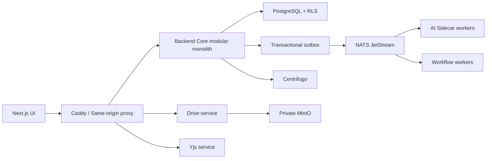

# تقرير التدقيق الشامل لمشروع Septimus OS

**تاريخ اللقطة:** 2026-07-26  
**نطاق المراجعة:** التوثيق، المصدر، الإعدادات، قاعدة البيانات، Docker، CI/CD، الاختبارات، والواجهة العاملة محليًا.  
**حالة المصدر:** شجرة العمل كانت تحتوي قبل هذا التقرير على تعديلات كثيرة وملفات غير متتبعة. لم يغيّر التدقيق أي ملف مصدر، ولم يقرأ ملف `.env` الحقيقي أو أي بيانات عملاء.  

## 1. الملخص التنفيذي

المشروع منصة SaaS متعددة المستأجرين واسعة الوظائف، مبنية كـ **Modular Monolith مع خدمات مساندة**:

- واجهة Next.js/React.
- نواة Go/Fiber/GORM/PostgreSQL.
- AI Sidecar مبني بـ FastAPI/LangChain/LangGraph.
- خدمة Drive مستقلة مع MinIO.
- خادم Yjs/WorkDocs مستقل.
- NATS وRedis وCentrifugo وCaddy وLangfuse، مع n8n اختياري.

البنية الأساسية معقولة، وعزل المستأجر تحسن بوضوح عبر request-scoped DB وRLS واتصالات داخلية موقعة. كما ثبت أن إصلاحي Workflow P0 السابقين الخاصين بتحديد مساحة العمل وسياسة الوجهات الخارجية موجودان حاليًا. لكن النظام **غير جاهز لإطلاق إنتاجي آمن** قبل إغلاق مجموعة من المخاطر الحرجة والعالية.

أهم النتائج:

1. التسجيل العام يثق في `plan_id` القادم من العميل، ويمكن إنشاء مساحة Enterprise من دون دفع.
2. صلاحيات AI Agents والحقائق المؤسسية أوسع من المطلوب؛ مستخدم عادي يستطيع تغيير إعدادات AI وتنفيذ عمليات إدارية.
3. إضافة عضو لقناة لا تقيد المستخدم المستهدف بمساحة العمل، ما يفتح ربطًا بين مستأجرين.
4. أسرار بوابات الدفع تحفظ وتُعاد كـ JSON صريح.
5. مسار Drive في Next يعترض مسار قائمة الملفات الموجه للنواة؛ العطل مؤكد فعليًا بـ HTTP 404.
6. استعلام المهام المثبتة يستخدم معامل JSONB بطريقة تكسر ربط GORM؛ العطل مؤكد فعليًا بـ HTTP 500.
7. تنفيذ Workflow الداخلي نحو AI يستخدم عميل SSRF المخصص للإنترنت، ولذلك يرفض عنوان `ai-sidecar` الخاص في الإنتاج.
8. Workflow يعد استجابات HTTP 4xx/5xx نجاحًا، ويخزن رؤوس وأسرار الإجراءات داخل JSON قابل للقراءة من جميع أعضاء المساحة.
9. رفع الملفات يعتمد على الامتداد و`Content-Type` المرسل من العميل، بلا فحص magic bytes أو malware scan، مع سباق في حصة التخزين.
10. لا توجد migrations إصدارية؛ `AutoMigrate` وDDL وعمليات backfill تعمل عند كل إقلاع.
11. فحص الاعتماديات وجد 5 ثغرات Go قابلة للوصول، و11 تنبيه npm إنتاجيًا، و78 تنبيه Python في 19 حزمة.
12. الاختبارات ليست خضراء بالكامل: Go وTypeScript ينجحان، ESLint يفشل، وPython داخل صورة التشغيل يسجل 176 نجاحًا وفشلًا واحدًا، وE2E الحالي محدود وغير مدمج في CI.

### قرار الجاهزية

**No-Go للإنتاج حاليًا.** يلزم إغلاق Critical وHigh الوظيفية والأمنية، ثم تشغيل بوابة اختبارات كاملة، وبعدها فقط إعادة بناء جميع الحاويات والتحقق الصحي والوظيفي.

## 2. منهجية ونطاق الفحص

تمت مراجعة:

- 115 ملف Markdown، بإجمالي يقارب 18,473 سطرًا، بما فيها الوثائق الحالية والأرشيف وكتالوج مهارات AI.
- نحو 190 ملف TSX، و129 ملف Go، و45 ملف Python.
- `package.json` وملفات lock، `go.mod`، `requirements.txt`، ملفات Docker Compose وDockerfiles وCaddy وGitHub Actions.
- النماذج، DDL، RLS، الفهارس، seeders المضمنة، ومسارات الملفات.
- الاختبارات الساكنة والتشغيلية، والحاويات العاملة، وسجلات الخدمات.
- تجربة UI فعلية على سطح المكتب والموبايل عبر متصفح التطبيق.

تم استبعاد:

- `node_modules`، البيئات الافتراضية، مجلدات build/dist، والسجلات الكبيرة.
- `.env` الحقيقي، المفاتيح والشهادات، وبيانات العملاء.
- أي تحليل يدعي اختبار اختراق خارجي أو تحميل إنتاجي؛ هذا تدقيق كود وتشغيل محلي.

## 3. خريطة المشروع

```text
septimus-os/
├── frontend/              Next.js 16 + React 19 + Zustand + Tailwind
├── backend-core/          Go Fiber API، GORM، PostgreSQL، RBAC، Workflows
├── ai-sidecar/            FastAPI، الوكلاء، RAG، الصوت، LangGraph
├── septimus-drive/        خدمة ملفات خاصة، MinIO، metadata، streaming
├── yjs-server/            Hocuspocus/Yjs لحفظ WorkDocs التعاونية
├── centrifugo/            إعداد realtime وقواعد subscribe proxy
├── docs/                  المرجع الحالي + archive + Notebook/NEXUS
├── skills/                مهارة تطوير محلية للمشروع
├── scripts/               أدوات مساندة
├── .github/workflows/     CI الحالي
├── docker-compose.yml     بيئة التطوير الكاملة
├── docker-compose.prod.yml بيئة الإنتاج
├── docker-compose.n8n.yml ملحق n8n
├── Caddyfile*             reverse proxy وTLS/security headers
├── .env.example           قالب المتغيرات بلا أسرار حقيقية
└── Makefile               أوامر التشغيل والبناء
```

### وظيفة المكونات

| المكون | المسؤولية | الملاحظة المعمارية |
|---|---|---|
| `frontend` | واجهة workspace والإدارة وDrive وWorkDocs وAI | ملف الصفحة الجذرية يحمل نطاقًا كبيرًا من الواجهات في Client Component واحد |
| `backend-core` | المصادقة، RBAC، البيانات، workflows، integrations، webhooks | Modular Monolith فعليًا، لكن handlers والخدمات متداخلة في بعض المجالات |
| `ai-sidecar` | اختيار المزود والوكلاء وRAG والصوت والمراقبة | اعتماديات ML كبيرة ومخاطر supply-chain مرتفعة |
| `septimus-drive` | رفع/تنزيل خاص إلى MinIO | فصل جيد، لكن سياسة النوع والحصة والفحص الأمني ناقصة |
| `yjs-server` | مزامنة وحفظ مستندات Yjs | العزل جيد إجمالًا، مع اختلاف major في Hocuspocus |
| PostgreSQL | بيانات المعاملات وJSONB وpgvector وltree | مرن، لكن migrations غير إصدارية وتغطية RLS جزئية |
| NATS/Centrifugo | أحداث backend وrealtime للواجهة | تسمية القنوات ليست موحدة بالكامل، والحمولات قد تحمل بيانات حساسة |
| Caddy | نقطة الدخول وTLS | أساس جيد، ينقصه CSP وبعض isolation headers |

## 4. حالة التوثيق

### ما تم التأكد منه

- لا توجد نسخ Markdown متطابقة byte-for-byte.
- الوثائق الحالية الأساسية هي:
  - `docs/00_AGENT_ONBOARDING.md`
  - `docs/01_SYSTEM_ARCHITECTURE.md`
  - `docs/02_DATABASE_AND_ENTITIES.md`
  - `docs/03_FRONTEND_AND_UI_RULES.md`
  - `docs/04_CURRENT_STATUS_AND_ROADMAP.md`
- توجد إعادة تنظيم كبيرة لوثائق قديمة إلى `docs/archive`.

### مشاكل التوثيق

| الأولوية | الموقع | المشكلة | الإصلاح |
|---|---|---|---|
| Medium | `docs/03_FRONTEND_AND_UI_RULES.md:12` | يشير إلى `frontend/public/locales` بينما الفعلي `frontend/src/locales` | تحديث المسار وإضافة فحص رابط في CI |
| Medium | `skills/septimus-os-developer/SKILL.md:23,64` | ما زال يذكر Next 14/15 و`middleware.ts` | تحديثه إلى Next 16 و`src/proxy.ts` |
| Low | عدة ملفات archive/notebook | روابط `file:///Users/...` مطلقة وغير قابلة للنقل | استبدالها بروابط نسبية |
| Medium | `.env.example` و`Makefile` | يشيران إلى `docs/N8N_AUTOMATION.md` و`docs/AI_OVERHAUL.md` بعد نقلهما للأرشيف | تحديث الروابط أو إنشاء صفحات redirect مختصرة |
| Medium | وثائق RLS وتعليقات `database.go:199-203,312-324` | تصف fallback قديمًا لا يطابق fail-closed الحالي | تحديث النص حتى لا يصبح مرجع التشغيل مضللًا |
| Low | `.pytest_cache/README.md` | ملف مولد دخل جرد Markdown | تجاهله في `.gitignore` |

ينبغي جعل الوثائق الأربع الحالية مرجعًا وحيدًا، ووضع banner واضح على كل ملف archive بأنه تاريخي وغير ملزم.

## 5. النتائج الحرجة والعالية

### C-01 — ترقية خطة عبر التسجيل العام

- **الموقع:** `backend-core/handlers/auth.go:330-368`
- **السبب:** `Workspace.Tier` و`Subscription.Tier` يأخذان `req.PlanID` مباشرة.
- **الأثر:** إنشاء tenant بميزات Enterprise وحصصه من دون Checkout أو webhook دفع موثوق.
- **سيناريو الاستغلال:** إرسال `plan_id=enterprise` إلى signup.
- **الإصلاح:** تجاهل الخطة القادمة من العميل، وإنشاء Starter/Trial ثابتة؛ لا تغير الخطة إلا خدمة billing بعد webhook موثوق.

```go
const onboardingTier = "starter"
workspace.Tier = onboardingTier
subscription.Tier = onboardingTier
```

أضف rate limiting وCAPTCHA/feature flag للتسجيل العام، واختبارًا يثبت أن أي `plan_id` مزور لا يغير الخطة.

### C-02 — مستخدم عادي يتحكم بوكلاء AI ومعرفة المؤسسة

- **الموقع:** `backend-core/main.go:224-226,329-345`
- **السبب:** غياب `RequireRole`/`CheckPermission` عن config، kill، deploy، dispatch، audit، morning brief، وكتابة/حذف facts.
- **الأثر:** تغيير المزود أو المفتاح، تعطيل الوكلاء، تشغيل تكلفة AI، أو تسميم RAG والمعرفة المؤسسية.
- **الاستغلال:** أي JWT لعضو workspace يستدعي هذه المسارات.
- **الإصلاح:** صلاحيات دقيقة مثل `ai.configure`, `agents.deploy`, `agents.execute`, `facts.manage`، مع default deny وسجل تدقيق.

### H-01 — ربط مستخدم من مستأجر آخر بقناة

- **الموقع:** `backend-core/handlers/channel_members.go:143-178`، وكذلك `handlers/channels.go:51-72`
- **السبب:** البحث عن `targetUser` بالبريد فقط، وقبول `UserIDs` من دون التأكد من `workspace_id`.
- **الأثر:** كسر حدود tenant، تسريب بيانات عضو، وإدخاله في private channel/realtime.
- **الإصلاح:** تحميل القناة بـ workspace الحالي، والبحث بـ `email + workspace_id`، والتحقق من كل ID داخل نفس tenant داخل transaction. أضف unique composite لـ `(channel_id,user_id)`.

### H-02 — أسرار بوابات الدفع بنص صريح

- **الموقع:** `backend-core/models/payment_gateways.go:17` و`handlers/payment_settings.go:9-45`
- **السبب:** `Credentials` JSONB غير مشفر، وGET/PUT يعيدان النموذج كاملًا.
- **الأثر:** تسريب مفاتيح merchant/API من DB dump أو logs أو جلسة super-admin.
- **الإصلاح:** تشفير envelope/AES-GCM بمفتاح مستقل أو secret manager، وعدم إرجاع السر بعد الحفظ؛ أعد فقط `has_credentials` وآخر 4 أحرف عند الحاجة.

### H-03 — Drive UI معطل بسبب تعارض rewrite

- **الموقع:** `frontend/next.config.ts:25-35` و`frontend/src/components/drive/DriveView.tsx:45-51`
- **الدليل التشغيلي:** `GET /api/v1/drive/files` وصل إلى خدمة Drive وأعاد 404؛ خدمة metadata موجودة في `backend-core/main.go:211`.
- **السبب:** rewrite العام `/api/v1/drive/:path*` يسبق rewrite النواة.
- **الإصلاح:** فصل namespace، مثل `/api/v1/drive-storage/*` للخدمة و`/api/v1/drive/files` للنواة، أو إضافة rewrite دقيق للقائمة قبل العام.

### H-04 — استعلام المهام المثبتة ينتج SQL غير صالح

- **الموقع:** `backend-core/handlers/pinned_tasks.go:238-242`
- **الدليل التشغيلي:** `/api/v1/my_pinned_tasks` يعيد 500 وخطأ PostgreSQL قرب placeholder الثالث.
- **السبب:** تعارض معامل JSONB `?` مع placeholders التي يفسرها GORM.
- **الإصلاح:**

```go
tx.Where(
  "workspace_id = ? AND entity_type = ? AND jsonb_exists(data->'assignees', ?)",
  workspaceID, "channel_pinned_task", userIDStr,
)
```

أضف integration test فعليًا على PostgreSQL؛ SQLite لا يكشف هذا النوع من الأعطال.

### H-05 — Workflow AI يفشل في الإنتاج بسبب سياسة SSRF

- **الموقع:** `backend-core/handlers/workflow_executor.go:337-366`
- **السبب:** `NewSafeHTTPClient` مصمم للوجهات الخارجية ويرفض HTTP/private DNS عندما `ALLOW_PRIVATE_OUTBOUND=false`، بينما الهدف الثابت `http://ai-sidecar:8000`.
- **الأثر:** عقد AI في workflows تفشل في production.
- **الإصلاح:** عميل داخلي منفصل يقبل فقط host/port ثابتين من config، مع mTLS أو token داخلي، ولا يقبل URL من المستخدم.

### H-06 — Webhook/Workflow يسجل نجاحًا كاذبًا ويسرب أسرارًا

- **الموقع:** `workflow_executor.go:173-261`، `models/models.go:278-299`، `main.go:324`
- **الأسباب:**
  - لا يعتبر HTTP 4xx/5xx فشلًا.
  - يسجل URL كاملًا، وقد يحتوي path/query سريًا.
  - `ActionHeaders` والأسرار داخل JSON workflow، بينما القراءة مفتوحة لكل عضو.
  - توقيع HMAC بلا timestamp/nonce، ما يسمح بإعادة التشغيل.
- **الإصلاح:** فشل عند status خارج 2xx، redaction للـ URL، تخزين secret reference فقط، قصر قراءة إعدادات العقد الحساسة، وإضافة timestamp + tolerance + idempotency key.

### H-07 — SSRF في Odoo

- **الموقع:** `backend-core/services/odoo_service.go:13-80`
- **السبب:** استخدام `http.Client` خام مع URL محفوظ من إعداد التكامل؛ اختبار الاتصال يطبق validation لكن عملية settlement لا تعيد التحقق ولا تستخدم pinned DNS.
- **الأثر:** admin مخترق أو config قديم يستطيع الوصول إلى metadata/internal services.
- **الإصلاح:** تمرير كل اتصال Odoo عبر `ValidateOutboundURL` و`NewSafeHTTPClient`، مع إعادة التحقق عند كل request.

### H-08 — رفع الملفات غير محصن وسباق الحصة

- **الموقع:** `backend-core/handlers/upload.go:49-166`، `handlers/documents.go:43-110`، `septimus-drive/main.go`
- **الأسباب:** extension allowlist فقط، الثقة في Content-Type، لا magic-byte scan ولا antivirus، وفحص الحصة ثم تحديثها ليسا عملية شرطية ذرية.
- **الأثر:** ملفات متنكرة/خبيثة، استهلاك تخزين، وتجاوز الحصة بطلبات متزامنة.
- **الإصلاح:** libmagic/filetype، quarantine، ClamAV أو scanner غير متزامن، أسماء object داخلية فقط، وحد ذري:

```sql
UPDATE workspaces
SET storage_used_bytes = storage_used_bytes + $1
WHERE id = $2
  AND storage_used_bytes + $1 <= storage_quota_bytes
RETURNING storage_used_bytes;
```

### H-09 — IDOR داخل مساحة العمل للملفات

- **الموقع:** `backend-core/handlers/upload.go` في مسار الحذف.
- **السبب:** أي عضو يمكنه حذف أي `FileRecord` في tenant، بلا owner/permission check.
- **الأثر:** حذف مستندات زملاء أو أقسام أخرى.
- **الإصلاح:** ACL موحد owner/department/admin، وربط كل download/delete بنفس policy service.

### H-10 — JWT طويل وغير قابل للإبطال

- **الموقع:** `backend-core/middleware/jwt.go:16-60` و`handlers/auth.go:391-404`
- **الأسباب:** قبول أي HMAC بدل HS256 تحديدًا، مدة 72 ساعة، لا `iss/aud/jti/session_version`، وتغيير كلمة المرور/logout لا يبطل token.
- **الأثر:** جلسة مسروقة تبقى صالحة، وصلاحيات role/workspace داخل claims تصبح قديمة.
- **الإصلاح:** access قصير + refresh rotation، session table/hash، `WithValidMethods(["HS256"])`، issuer/audience، وإبطال على password/role change. Cookie الحالي HttpOnly/Secure/SameSite Strict نقطة جيدة.

### H-11 — RLS جزئي والوثائق تبالغ في التغطية

- **الموقع:** `backend-core/database/database.go:299-379`
- **المشكلة:** RLS مطبق على قائمة من 10 جداول فقط. جداول tenant كثيرة تعتمد كليًا على filters البرمجية، مثل integrations، workflows، API keys، audit logs، file records، agent state، AI usage، webhooks، channels وبعض العلاقات.
- **الأثر:** نسيان `workspace_id` في handler واحد قد يصبح تسريبًا بين المستأجرين.
- **الإصلاح:** inventory آلي لكل جدول يحمل `workspace_id`، RLS و`WITH CHECK`، اختبارات tenant isolation على AppDB، ومنع استخدام `database.DB` داخل handlers عبر lint rule.

### H-12 — Mass assignment/Type confusion في Entities

- **الموقع:** `backend-core/handlers/subtasks.go:107-136` وgeneric entity update.
- **السبب:** UpdateSubtask يجلب entity بالـ ID فقط ولا يشترط `entity_type='sub_task'`، ثم يعيد كتابته كبيانات subtask. Generic JSONB updates تسمح حقولًا واسعة دون schema لبعض الأنواع.
- **الأثر:** إفساد أي entity داخل tenant، وتجاوز قواعد المجال.
- **الإصلاح:** استعلام scoped بالنوع والمساحة، enum للحالة، optimistic version، وDTO/schema لكل نوع قابل للتعديل.

### H-13 — اعتماديات قابلة للاستغلال

#### Go

`govulncheck ./...` وجد خمس ثغرات قابلة للوصول:

- `pgx/v5 5.6.0` — إصلاح `5.9.2`، خطر SQL injection متعلق بالـ placeholders.
- `x/text 0.38.0` — إصلاح `0.39.0`.
- ثلاث ثغرات في Go stdlib مع toolchain `1.26.3`، الإصلاح `1.26.4/1.26.5`.

#### Frontend

`npm audit --omit=dev` وجد 11 تنبيهًا: 6 High و5 Moderate. الأهم Next.js المباشر، والإصلاح المتاح `16.2.12`. توجد أيضًا sharp/postcss وtransitives مرتبطة بـ shadcn/MCP.

#### Python

`pip-audit -r requirements.txt` داخل Python 3.12 وجد 78 إدخالًا في 19 حزمة، أبرزها `aiohttp`, `requests`, `urllib3`, `langchain*`, `langsmith`, `Pillow`, `transformers`, `torch`, `langgraph*`.

يجب عدم ترقية منظومة LangChain الكبرى دفعة واحدة. أنشئ compatibility branch، ثبّت كل الحزم، وشغّل contract tests للوكلاء قبل الدمج.

## 6. نتائج متوسطة ومنخفضة

### الأمن والخصوصية

- **M-01:** التسجيل لا يطبق rate limit/lockout/MFA. أضف Redis sliding-window، exponential backoff، وتنبيه brute force.
- **M-02:** لا يوجد CSRF token. SameSite Strict جيد لكنه لا يغطي اختراق sibling subdomain. أضف Origin/Referer validation وdouble-submit token للعمليات الحساسة.
- **M-03:** `sanitizeHtml.ts:3-10` sanitizer مبني على regex. استبدله بـ DOMPurify/isomorphic-dompurify مع allowlist واختبارات payloads.
- **M-04:** `main.py` يعيد بعض تفاصيل الاستثناء الخام، وOAuth يعيد exchange errors. استخدم error IDs ورسائل عامة.
- **M-05:** مقارنة internal token في أحد مسارات HTTP Python ليست constant-time؛ استخدم `hmac.compare_digest` في كل المسارات.
- **M-06:** API text/prompt endpoints لا تضع حدودًا صريحة للحجم، ما يسمح cost/CPU DoS.
- **M-07:** Caddy ينقصه CSP وCOOP/CORP. ابدأ CSP Report-Only ثم شدده.
- **M-08:** GORM في `database.go:55-57` يعمل بـ Info دائمًا، ويسجل SQL ومعرفات tenant/user؛ اجعله Warn في الإنتاج مع redaction.
- **M-09:** impersonation token يرجع JSON بدل cookie HttpOnly؛ اجعله جلسة قصيرة قابلة للإبطال مع banner وسجل.
- **L-01:** مسار حذف ملف يستخدم path محفوظًا في DB؛ أضف `filepath.Clean` وتحقق containment تحت uploads root.

### جودة الكود

- ملفات frontend ضخمة: `CanvasTemplateDesigner.tsx` ~1484 سطرًا، `SettingsModal` ~1034، `Automations` ~806، `Attendance` ~789، `Sidebar` ~787، `TopBar` ~746.
- `ai-sidecar/nats_events.py` ~843 سطرًا و`main.py` ~571؛ ينبغي فصل routers، schemas، consumers، وdomain services.
- توجد ثلاثة تطبيقات webhook dispatch في handlers/services/utils بسلوك توقيع ومعالجة أخطاء غير موحد.
- handlers في Go تجمع parsing وauthorization وDB وevents وHTTP في دالة واحدة. استخرج application services وpolicy layer.
- توجد scripts تجريبية وملفات patch/DB في الجذر وbackend: `scratch*.py`, `test_db.go`, `update_ollama.sql`, `pinned_tasks.go_patch.txt`, `data.db`, `septimus.db`. صنفها أو انقلها أو احذفها بعد التأكد.
- `.gitignore` لا يغطي `*.db`, `.pytest_cache`, `test-results`, وبعض outputs.
- `reactStrictMode:false` يخفي مشاكل effects، ويجب تفعيله بعد معالجة الآثار الجانبية.

### الأداء

- **N+1 مؤكد:** `rag_handlers.go:118-135` ينفذ query لكل نتيجة semantic، حتى 50 query. اجمع IDs واستعمل `WHERE id IN (...)`.
- fallback البحث يستخدم `%query%` على `content` و`data::text`، ما يؤدي scans؛ استخدم FTS/trigram indexes وحدود query.
- DDL/backfills عند كل boot (`database.go:65-181`) قد تقفل جداول كبيرة، خصوصًا تحديث `tsv`.
- Workflows تعمل fire-and-forget goroutines بلا queue محدود أو retry policy أو idempotency أو cancellation.
- تسجيل SQL وhealth requests بكثافة يرفع I/O وحجم logs.
- الصفحة الجذرية في frontend تحمل نطاقًا واسعًا من views؛ استخدم dynamic imports وحدود route حقيقية وbundle analyzer.
- الصور/خطوط Google الخارجية أثناء build تجعل البناء غير قابل للتكرار في بيئة معزولة؛ self-host Cairo/Inter عبر `next/font/local`.

### قاعدة البيانات

- لا يوجد مجلد migrations إصداري ولا rollback؛ `AutoMigrate` ليس آلية نشر production.
- `User.Email` unique عالميًا، ما يمنع نفس البريد في أكثر من workspace. إن لم يكن هذا مقصودًا، استخدم unique `(workspace_id, normalized_email)`.
- `Role.Name` عالمي بلا WorkspaceID؛ حدد هل roles منصة أم tenant-custom.
- بعض `WorkspaceID` والـ FKs غير `NOT NULL` ولا توجد cascades/unique composites كافية.
- `WorkflowRun` لا يحمل `WorkspaceID` مباشرة، ما يصعب RLS والتحليلات.
- `TaskHistory` و`ChannelMember` يعتمدان على parent ownership فقط؛ أضف tenant key إن أمكن.
- JSONB Entity مرن لكنه يضعف constraints والاستعلامات. احتفظ به للأنواع الديناميكية فقط، وانقل المجالات المالية/الموارد/المهام الأساسية إلى جداول typed.
- لا توجد خطة backup/restore موثقة قابلة للاختبار. `backup_db.sh` وحده لا يكفي من دون retention، encryption، off-site، وrestore drill.

### الواجهة وتجربة المستخدم

- `src/proxy.ts:8` يحمي أربع prefixes فقط، بينما صفحات finance/hr/meetings/plugins/workflows وغيرها غير موجودة في القائمة. Backend يبقى boundary الأمني، لكن UX للحماية غير متسق.
- فحص صفحة login وجد labels غير مرتبطة بالحقول، والـ textboxes بلا accessible name.
- الواجهة العربية على 390×844 لم تسجل overflow أفقيًا، وهذه نقطة جيدة.
- Drive يحتوي نصوصًا إنجليزية hardcoded وبحثًا غير موصول بالحالة.
- يوجد hardcoded bilingual text واسع رغم قاعدة locale parity.
- `fetchWithAuth` يستخدم `alert()` blocking لبعض أخطاء الخادم بدل error boundary/toast موحد.
- صلاحيات frontend ينبغي أن تكون للعرض فقط؛ القرار النهائي يجب أن يبقى backend policy، وهو غير موحد حاليًا.
- Hocuspocus provider في frontend v4.3 بينما server v3.4؛ وحّد major version واختبر reconnect/offline/conflicts.

## 7. SQL Injection وXSS وبقية فئات الهجوم

| الفئة | النتيجة |
|---|---|
| SQL Injection | معظم الاستعلامات parameterized. الخطر المباشر الأهم هو نسخة pgx الضعيفة واستعلام JSONB المكسور. لا توجد أدلة على concatenation لمدخل مستخدم في SQL العام؛ أسماء جداول RLS constants. |
| XSS | خطر Stored XSS متوسط بسبب regex sanitizer وHTML templates. لا توجد `dangerouslySetInnerHTML` واضحة بلا sanitization في المسارات المفحوصة، لكن المكتبة الحالية غير كافية. |
| CSRF | SameSite Strict يخفف الخطر، لكن لا يوجد token/Origin gate للعمليات الحساسة. |
| Authentication | Cookie آمن نسبيًا؛ الجلسات طويلة وغير قابلة للإبطال ولا MFA/rate limiting. |
| Authorization/IDOR | ثغرات عالية في agent routes، facts، channel membership، file delete، generic entities. |
| Secret leakage | مفاتيح AI والتكاملات الأساسية مشفرة؛ Payment credentials وworkflow headers ليست كذلك، وبعض URLs/AI prompts تسجل. |
| Upload | private storage جيد، لكن MIME/magic/malware/quota controls ناقصة. |
| SSRF | URL policy الخارجية قوية ومقاومة DNS rebinding/redirect، لكن Odoo يتجاوزها وعميل AI الداخلي مستخدم بطريقة خاطئة. |
| Path traversal | المسار العام منخفض الخطر بفضل أسماء UUID، لكن حذف path من DB يحتاج containment. |
| Command injection | لم يظهر تنفيذ shell بمدخل مستخدم في خدمات runtime المفحوصة. |
| JWT | exact algorithm غير مفروض في backend-core، ولا revocation/session version. |
| CORS | allowlist وproduction requirements أفضل من wildcard؛ استمر بمنع credentials مع origins غير محددة. |
| Race conditions | حصة الملفات، بعض counters، وتنفيذ workflows بلا idempotency. |
| Mass assignment | JSONB entities وsubtask update يمثلان الخطر الأوضح. |
| Privilege escalation | plan_id وagent/facts routes هما المساران الأهم. |

## 8. المعمارية المقترحة

التحويل إلى Microservices إضافية الآن سيزيد المخاطر التشغيلية. الأنسب خلال 60–90 يومًا:

1. الإبقاء على `backend-core` كـ **Modular Monolith**.
2. تعريف وحدات مجال واضحة: Identity, Billing, Collaboration, Work Management, Documents, Automation, AI Control Plane.
3. لكل وحدة:
   - DTO/API adapters.
   - Application service.
   - Policy/authorization.
   - Repository.
   - Events/outbox.
4. إبقاء Drive وYjs وAI Sidecar خدمات منفصلة لأنها ذات احتياجات تشغيل وموارد مختلفة.
5. اعتماد transactional outbox بين PostgreSQL وNATS بدل publish المباشر بعد mutations.
6. نقل workflow execution إلى worker pool/queue مع leases وretry وdead-letter وidempotency.



## 9. الاختبارات والتحقق التشغيلي

### النتائج الفعلية

| الفحص | النتيجة |
|---|---|
| `go test ./...` | ناجح |
| `npx tsc --noEmit` | ناجح |
| `npm run lint` | فشل: خطآن في WorkDocs وتحذير meetings |
| Python داخل صورة 3.12 | 176 passed، 1 failed، تحذير واحد |
| سبب Python failure | test قديم يتوقع unknown agent أن يرث supervisor؛ الكود الحالي fail-closed إلى `_unknown` أصح أمنيًا |
| `yjs-server npm test` | placeholder يفشل عمدًا |
| Playwright | 3 smoke tests فقط؛ تشغيل CLI تعطل بسبب صلاحيات sandbox للمتصفح، لا بسبب assertion للتطبيق |
| فحص UI بمتصفح التطبيق | dashboard يعمل، redirect لـ `/admin` بلا جلسة يعمل، mobile login بلا overflow |
| Docker | جميع الخدمات الـ13 Up؛ الخدمات التي لها healthcheck ظهرت healthy |
| فحص وظيفي | Drive list = 404، pinned tasks = 500 |
| Next build | توقف بسبب تنزيل Google Fonts في بيئة بلا DNS؛ typecheck نجح |

### فجوات الاختبار

- لا توجد E2E تغطي signup/billing/tenant isolation/Drive/WorkDocs/workflows.
- smoke test ينشئ workspace حقيقيًا بلا teardown.
- CI لا يشغل E2E ولا `next build` ولا audits.
- لا يوجد PostgreSQL integration test للاستعلامات الخاصة بـ JSONB/RLS.
- لا يوجد Go race detector أو govulncheck في CI.
- لا يوجد secret scan أو SBOM أو image scan أو IaC scan.
- Python CI يستخدم 3.11 بينما Docker يستخدم 3.12.12.
- لا توجد load/security regression tests.

### بوابة جودة مقترحة

يمنع الدمج أو النشر ما لم تنجح:

1. Go: format, vet, tests, race, govulncheck.
2. Python 3.12: lock verification, pytest, pip-audit allowlist مؤقت موثق.
3. Frontend: lint, typecheck, unit/component، production build.
4. PostgreSQL integration: migrations up/down، RLS cross-tenant، JSONB queries.
5. Playwright: login، RBAC، Drive upload/list/download/delete، WorkDocs collaboration، workflow 2xx/5xx، billing webhook.
6. Docker Compose ephemeral environment + health + smoke.
7. Trivy/Grype image scan، Gitleaks، SBOM، وتوقيع الصور.

## 10. Docker وCI/CD والتشغيل

### نقاط جيدة

- production compose يستخدم `${VAR:?}` لمعظم الأسرار الحرجة.
- AI وYjs وLangfuse ليست منشورة مباشرة على host.
- MinIO bucket خاص.
- Caddy يقدم TLS وHSTS وnosniff وreferrer/permissions headers.

### مشاكل

- صور متعددة mutable: `redis:alpine`, `nats:alpine`, `caddy:alpine`, `minio/minio`, `langfuse:2`, `postgres:17`.
- backend/frontend في dev منشوران على كل interfaces، بينما بقية البنية غالبًا loopback.
- production compose يفتقد healthchecks لمعظم الخدمات؛ `depends_on: service_started` ليس readiness.
- لا deploy workflow، ولا canary/rollback، ولا migration job مستقل.
- لا metrics stack/alerts حقيقية؛ Langfuse يغطي LLM tracing فقط.
- لا backup job ولا restore verification.
- استخدام `:latest` لصور التطبيق يمنع rollback موثوق.

الإصلاح: digest pinning، tags immutable مرتبطة بـ commit SHA، health/readiness لكل خدمة، migration job، registry scanning، deploy approval، smoke بعد النشر، وrollback تلقائي عند فشل SLO.

## 11. Google وNext.js

- انتقال Next.js من `middleware.ts` إلى `proxy.ts` **مكتمل في الكود الحالي**؛ الملف `frontend/src/proxy.ts` يستخدم `proxy`، ولم يظهر تحذير middleware القديم أثناء build.
- انتقال Google Generative AI **غير مكتمل**. `backend-core/go.mod` ما زال يستخدم `github.com/google/generative-ai-go v0.20.1` في embeddings والتقارير. Google تصنف المكتبات القديمة legacy/deprecated وتوصي بـ `google.golang.org/genai`.
- Python يستخدم `langchain-google-genai` وليس SDK Python القديم مباشرة، لكن يجب اختبار توافق السلسلة عند الترقية.

مراجع رسمية:

- [Google Gemini API libraries](https://ai.google.dev/gemini-api/docs/libraries)
- [Google Gemini SDK migration guide](https://ai.google.dev/gemini-api/docs/migrate)
- [Next.js middleware-to-proxy](https://nextjs.org/docs/messages/middleware-to-proxy)
- [Next.js 16 upgrade guide](https://nextjs.org/docs/app/guides/upgrading/version-16)

## 12. ترتيب الأولويات

### Critical / P0

1. تثبيت tier التسجيل ومنع أي ترقية من مدخل العميل.
2. إغلاق agent config/kill/deploy/dispatch/audit وfacts بصلاحيات دقيقة.
3. ترقيع Go/pgx/Next المباشر قبل أي نشر.

### High / P1

1. عزل channel membership داخل tenant.
2. تشفير وعدم إرجاع Payment credentials.
3. إصلاح Drive route وpinned tasks SQL.
4. فصل عميل AI الداخلي عن SSRF client.
5. إصلاح status handling وأسرار/replay في workflows/webhooks.
6. إغلاق Odoo SSRF.
7. تقوية upload/quota/file ACL.
8. session revocation وJWT validation.
9. توسيع RLS واختبارات tenant.
10. إصلاح subtask/entity mutation.
11. migrations إصدارية.

### Medium / P2

- sanitizer وCSRF وrate limit وCSP.
- N+1 وFTS وboot migrations.
- توحيد Hocuspocus والقنوات والمسارات الداخلية.
- تفكيك الملفات الكبيرة وتوحيد error handling/localization.
- E2E وCI/CD والمراقبة والنسخ الاحتياطي.

### Low / P3

- تنظيف scripts والملفات المولدة.
- تحديث archive links والتعليقات القديمة.
- تحسين التسميات وتوحيد النصوص المتبقية.

## 13. خطة العمل

### الإصلاحات الفورية: 0–72 ساعة

| العمل | التعقيد | المخاطر |
|---|---:|---|
| إصلاح signup tier وإضافة اختبار abuse | منخفض | منخفض |
| إضافة permission guards لمسارات AI/facts | متوسط | متوسط؛ يحتاج مصفوفة أدوار |
| إصلاح channel tenant check | منخفض | منخفض |
| إصلاح pinned SQL وDrive routing | منخفض | منخفض |
| ترقية Go toolchain/pgx/x-text وNext patch | متوسط | متوسط |
| إيقاف إرجاع Payment credentials وتشفير الجديد | متوسط | يحتاج migration للقديم |
| تعطيل/feature-flag التسجيل العام إن لم يكن مطلوبًا | منخفض | أثر تجاري محتمل |

### أول 7 أيام

1. معالجة workflow HTTP status، internal AI client، secret references، URL redaction، replay protection.
2. Odoo safe client.
3. upload magic scan + atomic quota + ACL موحد.
4. refresh/session store وrate limiting.
5. تحديث Python test الفاشل، ESLint، واختبار Yjs الحقيقي.
6. PostgreSQL integration suite لـ tenant/RLS/JSONB.
7. ترحيل Google Go SDK إلى `google.golang.org/genai`.
8. إنشاء dependency lock/constraints وخطة ترقيات Python متدرجة.

### 30 يومًا

1. اعتماد versioned migrations وإزالة DDL/backfills من startup.
2. توسيع RLS لكل جداول tenant وإضافة lint يمنع privileged DB في handlers.
3. worker queue للـ workflows مع outbox/idempotency/dead-letter.
4. E2E فعلي ومعزول مع teardown وfixtures.
5. CI security gates، SBOM، image scanning، secret scanning.
6. self-host fonts، code splitting، bundle budgets.
7. DOMPurify وCSP Report-Only ثم enforcement.
8. backups مشفرة off-site وتجربة restore موثقة.

### 60–90 يومًا

1. إعادة تنظيم backend إلى bounded modules وpolicy/application/repository layers.
2. تحويل المجالات الحرجة من JSONB إلى typed tables تدريجيًا.
3. توحيد naming contract لـ NATS/Centrifugo/internal AI/n8n في package/schema واحد.
4. OpenTelemetry traces/metrics، Prometheus/Grafana أو بديل، log redaction، SLOs وalerts.
5. load tests وchaos/failure drills للـ NATS/Postgres/MinIO/AI.
6. immutable releases، staging، canary/blue-green، migration rollback، وDR runbook.

## 14. ترتيب التنفيذ وإعادة بناء Docker

لا ينبغي إعادة بناء الحاويات الآن لأن التدقيق لم يطبق إصلاحات المصدر، ولأن إعادة البناء قبل إغلاق P0 ستنتج صورًا جديدة تحمل العيوب نفسها.

الترتيب الصحيح بعد اعتماد خطة التنفيذ:

1. إنشاء branch/لقطة نظيفة مع حماية التعديلات الحالية.
2. تنفيذ P0/P1 على دفعات صغيرة.
3. تشغيل بوابة الاختبارات كاملة.
4. بناء الصور كلها بـ `--no-cache` وtags immutable.
5. تشغيل stack جديد من volumes اختبارية، لا على بيانات العملاء.
6. migrations ثم health/readiness.
7. smoke وظيفي: auth/RBAC، tenant isolation، Drive، WorkDocs، workflows/n8n، AI، webhooks.
8. security scans وlog review.
9. قبول النتيجة ثم النشر التدريجي.

معايير القبول النهائية:

- صفر Critical/High قابلة للوصول أو استثناء موثق بموافقة.
- كل الاختبارات خضراء.
- لا 404/500 في المسارات الأساسية.
- cross-tenant suite تفشل مغلقة.
- restore drill ناجح.
- كل الحاويات healthy وتستخدم image digests معلومة.
- dashboard للمؤشرات والتنبيهات يعمل قبل استقبال حركة حقيقية.

## 15. الخلاصة

المنتج غني ويحتوي إصلاحات أمنية جيدة حديثة، خصوصًا tenant context في webhooks، URL policy، تشفير مفاتيح التكامل، وprivate Drive storage. لكن الاتساع الوظيفي سبق نضج حواجز الصلاحيات والمigrations والاختبارات التشغيلية. الأولوية ليست إضافة مزيد من الخدمات؛ بل تثبيت حدود tenant وRBAC، إصلاح الأعطال المؤكدة، إغلاق supply-chain findings، ثم جعل النشر قابلاً للتكرار والمراقبة والاسترجاع.

هذا التقرير هو baseline للمراجعة. أي إصلاح لاحق يجب ربطه بمعرف finding واختبار regression ومعيار قبول قبل إعادة بناء Docker.
