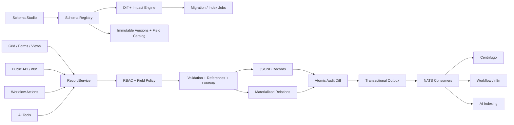

# خطة التنفيذ الاحترافية لاستكمال منشئ المخططات

**المشروع:** Septimus OS  
**النطاق:** منشئ المخططات ومحرك البيانات بدون كود  
**تاريخ الخطة:** 2026-07-28  
**حالة الوثيقة:** خطة تنفيذ معتمدة على الكود الحالي، وليست إعادة اقتراح للأساس المنجز

> **تحديث التنفيذ — 2026-07-28:** اكتملت الحزمة الأولى الخاصة بكتالوج الحقول
> والأمن الحقلي والتحقق المرجعي والتدقيق الذري وتكامل الواجهة، مع إعادة بناء
> Docker واختبارات تشغيلية. التفاصيل والأدلة في
> `SCHEMA_BUILDER_IMPLEMENTATION_REPORT_2026-07-28.md`.
>
> **تحديث التنفيذ — 2026-07-29:** اكتملت المرحلة 2 الخاصة بـSchema Diff
> وImpact Review وبوابة الموافقة والترحيلات القابلة للاستئناف ودورة
> Deprecate/Hide/Cleanup والأرشفة واستعادة الإصدارات. انتقلت الخطوة التالية
> إلى المرحلة 3: Schema Studio، ثم Forms/Views.
>
> **تحديث التنفيذ — 2026-07-30:** اكتملت المرحلة 3 الخاصة بـSchema Studio:
> تبويبات الحقول والعلاقات والبيانات والإصدارات والنشاط، الهوية ثنائية اللغة،
> الحفظ التلقائي، Undo/Redo، معالجة التعارض المتفائل، معاينة Desktop/Mobile،
> ومحرر معادلات بمعاينة آمنة من الخادم. نجحت بوابات الجودة وDocker وE2E.
> الخطوة التالية هي المرحلة 4: Forms وViews المحفوظة.
>
> **تحديث التنفيذ — 2026-07-30 (الحزمة التالية):** نُفذت نواة المرحلة 4:
> `entity_forms` و`entity_views` مع RLS والقفل التفاؤلي والتدقيق، Form Builder
> بأقسام وأعمدة، وView Builder لأنواع Table/Kanban/Calendar/Gallery والفلاتر
> والمشاركة. أصبحت شاشة البيانات تطبق النموذج وطريقة العرض الافتراضية وتستخدم
> Cursor pagination، كما استبدلت حقول user/file النصية بقوائم مستأجرية آمنة.

## 1. الهدف النهائي

تحويل منشئ المخططات الحالي من نواة آمنة لإدارة التعريفات والسجلات إلى
منصة بيانات بدون كود مكتملة، ثنائية اللغة، متعددة المستأجرين، وقابلة للاستخدام
في الوحدات التشغيلية وWorkflow وn8n وAI دون وجود مسارات كتابة جانبية.

النتيجة النهائية يجب أن تتيح لمسؤول مساحة العمل:

1. إنشاء مخطط ثنائي اللغة وتخصيص حقوله وقواعده.
2. معاينة أثر التغيير على السجلات والعلاقات والتكاملات قبل النشر.
3. نشر إصدارات ثابتة، أو أرشفتها، أو إعادة نشر إصدار سابق كإصدار جديد.
4. بناء نماذج وطرق عرض وجدول بيانات وKanban وتقويم.
5. ربط المخططات والسجلات بعلاقات موثوقة وعرضها في ERD تفاعلي.
6. استخدام معادلات وLookup وRollup ضمن لغة آمنة ومحدودة.
7. استيراد وتصدير البيانات مع معاينة وتقرير أخطاء واسترجاع.
8. تشغيل Workflows وn8n وCentrifugo وAI من العقود نفسها.
9. فرض الصلاحيات والتصنيف والحجب على مستوى المخطط والسجل والحقل.
10. العمل بأداء قابل للقياس عند مئات آلاف السجلات دون كتابة SQL من المستخدم.

## 2. الثوابت غير القابلة للتفاوض

- تبقى السجلات الديناميكية في `entities.data JSONB`؛ لا ينشئ المستخدم جداول
  PostgreSQL أو أوامر DDL مباشرة.
- تبقى الجداول النظامية الحساسة Typed ولا تُنقل إلى منشئ المخططات.
- المفتاح التقني للمخطط والحقل ثابت بعد أول نشر.
- كل نشر ينشئ إصدارًا غير قابل للتعديل.
- كل كتابة تمر عبر `RecordService`؛ ويشمل ذلك الواجهة وAPI وWorkflow وn8n وAI.
- لا يستخدم محرك المعادلات `eval` أو JavaScript أو SQL.
- كل جدول جديد يحمل `workspace_id` وتطبق عليه RLS واختبارات عزل.
- الملفات تبقى مراجع خاصة إلى Drive/WorkDocs ولا تتحول إلى روابط عامة.
- قنوات الوقت الحقيقي تلتزم بالدستور الحالي، وأساس بث بيانات المنشئ هو
  `workspace_<uuid>` مع تصفية الحدث بواسطة `definition_key`.
- جميع النصوص في الواجهة تمر عبر `ar.json` و`en.json` بتطابق 1:1.
- تستخدم الواجهة CSS منطقيًا لـRTL/LTR ومتغيرات الثيم الحالية.
- لا يُعد أي Sprint مكتملًا دون اختبارات، ولا يُعد الإصدار جاهزًا دون إعادة
  بناء Docker كاملة وفحوص صحية ووظيفية.

## 3. خط الأساس المنجز الذي لن يعاد بناؤه

المكونات التالية موجودة وتُعامل كأساس يجب تطويره لا استبداله:

- `entity_definitions` وتعريف ثابت للمخطط.
- `entity_schema_versions` وإصدارات نشر غير قابلة للتعديل.
- `DraftRevision` وقفل تفاؤلي لمسودة المخطط.
- صلاحيات `schemas.*` و`records.*` وFeature Flag وحصص الباقات.
- JSON Schema مولد من الخادم ومنع الحقول الإضافية.
- Record API مستقل وRecordService مركزي.
- Query AST آمنة بربط معاملات SQL وCursor pagination أساسي.
- علاقات منشورة وروابط سجلات مادية وسياسات حذف.
- Parser وAST للمعادلات الرقمية وكشف الدورات.
- Transactional Outbox وتسليم at-least-once.
- أحداث `data.schema.published` و`data.record.*`.
- ربط أساسي بـWorkflow وn8n Webhooks وCentrifugo وفهرسة AI.
- واجهة إنشاء/تعديل/حذف سجلات ديناميكية.
- اختبارات Go وE2E أساسية للنشر والمعادلات والاستعلام.

## 4. الفجوات الحالية مرتبة بالأولوية

| الأولوية | الفجوة | القرار التنفيذي |
|---|---|---|
| منجز | كان يمكن نشر تغيير كاسر دون Impact Review أو Backfill | أصبح النشر بعد الإصدار الأول مقيدًا بتقرير أثر مطابق وموافقة مخولة وخطة ترحيل عند الحاجة |
| منجز | كان حقل `user` و`file` يتحقق من UUID فقط | أصبحت المراجع تتحقق من العضوية والملكية والحالة الأمنية |
| منجز | لم يوجد Audit diff ذري لكل تغيير سجل | أصبح التدقيق جزءًا من معاملة الكتابة |
| منجز | لم توجد صلاحيات Field-level | أضيفت سياسات قراءة/كتابة وحجب للحقول الحساسة |
| منجز | كانت الواجهة ملفًا ضخمًا وتجربة التحرير محدودة | أصبح Schema Studio معياريًا مع Autosave وUndo/Redo وحل التعارض |
| منجز | لم يوجد Catalog علائقي لحقول الإصدار | ينشأ `entity_schema_fields` ذريًا عند النشر |
| P1 | Query AST لا تدعم الفرز والإسقاط والعلاقات أو حقول النظام | إصدار Query AST v2 مع Complexity Budget |
| P1 | لا توجد Forms أو Views محفوظة | إضافة `entity_forms` و`entity_views` |
| P1 | لا يوجد ERD فعلي أو Lookup/Rollup | بناء Relation Studio ومحرك تبعيات |
| P1 | لا يوجد استيراد/تصدير أو عمليات Bulk | تنفيذ Jobs قابلة للاستئناف مع Idempotency |
| P1 | Outbox بلا لوحة Replay/Dead-letter أو قياسات واضحة | إضافة مراقبة وإعادة تشغيل إدارية آمنة |
| منجز | كانت اختبارات المنشئ E2E تستخدم API أكثر من الواجهة | تغطي Playwright واجهة الاستوديو وتدفق التعارض والنشاط فعليًا |
| منجز | لم يوجد Autosave وUndo/Redo أو حل تعارض مرئي | أضيف تاريخ محلي وخيار إعادة تحميل أو إعادة تطبيق صريحة |
| P2 | أنواع الحقول وقيودها محدودة | توسيع العقد تدريجيًا مع ترحيلات آمنة |
| P2 | تكامل Workflow يعرض Triggers فقط | إضافة Actions وConditions متخصصة للبيانات |
| P2 | AI لا يبني مسودة أو Query AST من داخل المنشئ | إضافة مساعد مقيد مع معاينة وموافقة بشرية |

## 5. المعمارية المستهدفة

## 6. نموذج البيانات المستهدف

### 6.1 جداول جديدة

#### `entity_schema_fields`

Catalog غير قابل للتعديل لكل إصدار منشور:

- `workspace_id`
- `definition_id`
- `schema_version`
- `field_key`
- `type`
- `position`
- `required`
- `unique_value`
- `searchable`
- `indexed`
- `classification`
- `read_policy`
- `write_policy`
- `config`

المفتاح الفريد:

`(definition_id, schema_version, field_key)`

لا يستبدل JSON Schema؛ بل يوفر Metadata قابلة للاستعلام للتكاملات والفهرسة
والصلاحيات.

#### `entity_views`

- نوع العرض: `table | kanban | calendar | gallery`
- الأعمدة والترتيب والحجم.
- Query AST محفوظة.
- الفرز والتجميع.
- مالك العرض ومستوى المشاركة.
- `view_revision` للقفل التفاؤلي.

#### `entity_forms`

- أقسام وتخطيط Responsive.
- ترتيب الحقول والنصوص المساعدة.
- وضع `create | edit | readonly`.
- قواعد ظهور محدودة ومتحقق منها.
- صلاحيات النموذج وحالته.

#### `entity_schema_change_jobs`

- الإصدار المصدر والهدف.
- نوع المهمة: `impact | backfill | index | cleanup`.
- الحالة والتقدم والعدادات والأخطاء.
- Cursor للاستئناف.
- مقدم الطلب والموافق.
- Idempotency key.

#### `entity_import_jobs` و`entity_import_errors`

- الملف الخاص ومخطط Mapping.
- وضع الإنشاء/التحديث.
- Dry run وعدادات النجاح والفشل.
- أخطاء صفية قابلة للتنزيل.
- Batch cursor واسترجاع آمن.

#### `record_idempotency_keys`

يمنع تكرار عمليات الإنشاء والتحديث القادمة من API وn8n وWorkflow عند إعادة
المحاولة.

### 6.2 توسيعات الجداول الحالية

- إضافة `published_revision` أو مرجع واضح للمسودة التي أنشأت الإصدار.
- إضافة حالة السجل وحقول الاستعادة إن اعتُمد Trash.
- إضافة فهارس جزئية للـjobs والـoutbox وطرق العرض.
- عدم إنشاء Expression Index قبل موافقة Index Planner وحصة الباقة.

## 7. عقد الحقول v2

كل حقل يحصل على عقد موحد:

- هوية: `key`, `label_ar`, `label_en`, `description_ar`, `description_en`.
- نوع وعرض: `type`, `format`, `widget`, `width`, `position`.
- تحقق: `required`, `default`, `min`, `max`, `pattern`, `precision`.
- بيانات: `unique`, `searchable`, `indexed`.
- أمن: `classification`, `read_roles`, `write_roles`, `masking`.
- تكامل: `include_in_ai`, `include_in_export`, `include_in_events`.
- إعدادات خاصة بالنوع داخل `config`.

الأنواع تنفذ على دفعات:

1. تثبيت الأنواع الحالية.
2. `long_text`, `decimal`, `money`, `percent`, `email`, `url`, `phone`,
   `multi_select`, `status`, `team`, `autonumber`.
3. `lookup`, `rollup`, `rich_text`, `geo`.

## 8. Query AST v2

العقد الجديد يدعم:

- `filter`: المجموعات والعمليات الحالية مع تحقق نوعي للقيم.
- `sort`: قائمة حقول واتجاهات مسموحة.
- `select`: إسقاط حقول مسموحة فقط.
- `search`: بحث في الحقول المنشورة كـ`searchable`.
- `include`: توسعة علاقات بعمق أقصى 1 افتراضيًا.
- `group` و`aggregate`: Endpoint تحليلي منفصل وحدوده أقل.
- حقول نظام allowlisted مثل `created_at`, `updated_at`, `created_by`.
- Cursor موقّع يحتوي نسخة الاستعلام والإصدار والترتيب.
- Complexity score وحد أعلى بحسب الباقة.

لا يسمح بـSQL أو JSONPath أو أسماء أعمدة أو عمليات غير موجودة في Catalog
الإصدار المنشور.

## 9. مراحل التنفيذ

### المرحلة 0 — تثبيت خط الأساس وإزالة الدين التقني

**المدة:** 3–5 أيام  
**التعقيد:** متوسط  
**الاعتماد:** لا يوجد

المهام:

- تحديث وثائق الحالة والعقود لتتطابق مع الكود الحالي.
- تقسيم `EntityCreator.tsx` إلى Shell وField List وProperty Panel وPreview.
- استخراج Types وAPI client وReact Query hooks مشتركة.
- إضافة Error codes موحدة وعدم عرض رسائل Backend الخام.
- تثبيت اختبارات Regression لكل ما هو منجز.
- إضافة ADR يثبت JSONB hybrid architecture ودورة النشر.

معيار القبول:

- لا يتغير السلوك الوظيفي الحالي.
- تنجح الاختبارات الحالية.
- لا يتجاوز أي مكون رئيسي حدودًا متفقًا عليها دون سبب موثق.
- تطابق مفاتيح AR/EN يبقى 1:1.

### المرحلة 1 — Field Catalog والتحقق المرجعي والأمن الحقلي

**المدة:** 6–9 أيام  
**التعقيد:** عالٍ  
**الاعتماد:** المرحلة 0

المهام:

- Migration وجدول `entity_schema_fields`.
- Materialization ذري للحقول عند النشر.
- توسيع Field Contract بالقيود والتصنيف والسياسات.
- Validator لعضو مساحة العمل في حقول `user/team`.
- Validator لملكية وحالة فحص ملفات Drive/WorkDocs.
- Field-level read/write projection داخل RecordService.
- Masking للحقول المصنفة وإزالتها من Events/AI افتراضيًا.
- Audit diff ذري لإنشاء وتعديل وحذف السجل.

معيار القبول:

- لا يمكن ربط مستخدم أو ملف من مساحة أخرى.
- لا يظهر حقل محجوب في API أو Export أو Event أو Embedding.
- Catalog كل إصدار يطابق Checksum المخطط.
- اختبارات RLS وRBAC والـMass Assignment خضراء.

### المرحلة 2 — Diff وImpact Review والترحيلات

**المدة:** 8–12 يومًا  
**التعقيد:** عالٍ جدًا  
**الاعتماد:** المرحلة 1

**الحالة في 2026-07-29:** مكتملة في النواة والواجهة والاختبارات. يشمل ذلك
فحص السجلات على دفعات ثابتة الذاكرة، Workflow dependencies، RLS، idempotency،
pause/resume، Audit/Outbox، شاشة مقارنة الإصدارات واختبار E2E للمنع ثم
الـbackfill. ستُضاف أعداد Forms/Views الفعلية عندما تنشأ جداولها في المرحلة 4؛
العقد الحالي يعيدها صفرًا صراحة ولا يدّعي فحص موارد غير موجودة.

المهام:

- محرك Schema diff يصنف التغييرات إلى:
  `safe | conditional | breaking`.
- Endpoint `POST /schema-definitions/:id/impact`.
- فحص السجلات الحالية والعلاقات والمعادلات والنماذج والـViews والـWorkflows.
- Job قابل للاستئناف للـBackfill وتحويل الأنواع.
- منع جعل الحقل Required دون Default أو خطة معالجة.
- Deprecate ثم Hide ثم Cleanup للحذف.
- Archive/Restore للمخطط.
- Rollback بواسطة إعادة نشر Snapshot سابق كإصدار جديد.
- شاشة مقارنة إصدارين وتقرير أثر قبل النشر.

معيار القبول:

- لا ينشر تغيير كاسر من دون Impact ناجح وموافقة مخولة.
- يمكن إيقاف Job واستئنافه دون مضاعفة التعديلات.
- كل نشر أو ترحيل له Audit وOutbox وحالة قابلة للمراقبة.
- تظل الإصدارات المنشورة السابقة غير قابلة للتعديل.

### المرحلة 3 — Schema Studio الاحترافي

**المدة:** 8–12 يومًا  
**التعقيد:** عالٍ  
**الاعتماد:** المرحلتان 0 و2

المهام:

- تخطيط: قائمة المخططات، مساحة العمل، لوحة الخصائص.
- تبويبات: الحقول، العلاقات، النماذج، طرق العرض، البيانات، الإصدارات، النشاط.
- عرض الاسم العربي والإنجليزي معًا بدل تعديل لغة واحدة فقط.
- Autosave بـdebounce مع حالة مزامنة.
- Undo/Redo محلي وتاريخ تغييرات المسودة.
- حوار تعارض يعرض Reload أو Merge آمن.
- معاينة Form وTable على Desktop/Mobile.
- Formula editor مع autocomplete لمفاتيح الحقول وPreview من الخادم.
- دعم لوحة المفاتيح، Focus management، قارئ الشاشة وRTL/LTR.

معيار القبول:

- بناء مخطط ونشره بالكامل من الواجهة دون API مباشر.
- لا تضيع تعديلات عند تعارض محررين.
- اجتياز تدفق AR وEN على Desktop وMobile.
- لا توجد نصوص Hardcoded أو اتجاهات CSS مادية.

### المرحلة 4 — Forms وViews وData Grid

**المدة:** 10–14 يومًا  
**التعقيد:** عالٍ  
**الاعتماد:** المرحلتان 1 و3

المهام:

- إنشاء `entity_forms` و`entity_views`.
- Form Builder بأقسام وأعمدة وتعليمات وقواعد ظهور محدودة.
- Widgets فعلية للمستخدم والفريق والملف والعلاقة والمال والتاريخ.
- Data Grid افتراضي للصفوف والأعمدة الكبيرة.
- Pagination حقيقية تستخدم `next_cursor`.
- Sort وFilter builder وColumn chooser وSaved Views.
- Views: Table أولًا، ثم Kanban، ثم Calendar، ثم Gallery.
- Bulk select وتحديث/أرشفة ضمن صلاحيات واضحة.
- معالجة تعارض `record_version` بحوار مقارنة.

معيار القبول:

- جميع أنواع الحقول المنشورة لها Widget إدخال وعرض.
- لا يستخدم المستخدم UUID خامًا لاختيار مستخدم أو ملف.
- View محفوظة تعيد نفس النتائج والترتيب بعد إعادة الدخول.
- p95 للعرض الشائع أقل من 300ms ضمن بيانات الاختبار.

### المرحلة 5 — ERD والعلاقات وLookup/Rollup

**المدة:** 8–12 يومًا  
**التعقيد:** عالٍ جدًا  
**الاعتماد:** المراحل 1–4

المهام:

- ERD تفاعلي بـReact Flow مع بديل نصي Accessible.
- إظهار العلاقات الداخلة والخارجة والكاردينالية وسياسة الحذف.
- Reverse relation افتراضية دون تكرار مصدر الحقيقة.
- فلاتر على العلاقات وRelation picker يدعم البحث والـCursor.
- Lookup لقراءة حقل من سجل مرتبط.
- Rollup: count/sum/min/max/avg ضمن أنواع مسموحة.
- Dependency graph موحد للـFormula/Lookup/Rollup.
- إعادة حساب عبر Outbox مع Idempotency ومنع الحلقات.
- إصلاح nullify/cascade ليولد Audit وEvents لكل سجل متأثر.

معيار القبول:

- لا يمكن إنشاء دورة تبعية.
- تحديث سجل مصدر يعيد حساب القيم التابعة مرة واحدة.
- سياسات الحذف تعمل ذريًا وتنتج Audit/Events كاملة.
- ERD يعرض مخططًا كبيرًا دون تجميد الواجهة.

### المرحلة 6 — الاستيراد والتصدير والعمليات الجماعية

**المدة:** 6–10 أيام  
**التعقيد:** عالٍ  
**الاعتماد:** المرحلتان 2 و4

المهام:

- CSV/XLSX Preview مع اكتشاف الترميز والعناوين.
- Mapping للحقول والقوائم والعلاقات والمستخدمين.
- Dry run وتقرير أخطاء قبل التنفيذ.
- Batch processing وIdempotency وResume.
- Upsert فقط بمفتاح فريد مصرح.
- Export يحترم Field-level security والتصنيف.
- ملفات النتائج والأخطاء خاصة ومحدودة العمر.
- حدود حجم وعدد صفوف حسب الباقة.

معيار القبول:

- فشل صف لا يفسد بقية Batch.
- إعادة المحاولة لا تنشئ سجلات مكررة.
- لا يظهر حقل محجوب أو ملف خاص في التصدير.
- يمكن تتبع Job وإلغاؤه واستئنافه.

### المرحلة 7 — Workflow وn8n وCentrifugo وAI

**المدة:** 7–11 يومًا  
**التعقيد:** عالٍ  
**الاعتماد:** المراحل 1–6

المهام:

- Workflow triggers مع اختيار المخطط والحقول وQuery AST.
- Actions: Create, Update, Link, Query, Archive.
- اعتماد `RecordService` داخل كل Action.
- حزمة n8n versioned تشمل Credentials وTriggers وActions نفسها.
- Idempotency-Key تلقائي لكل تنفيذ n8n/Workflow.
- Event envelope موحد مع `event_id`, actor و`changed_fields`.
- استمرار البث عبر `workspace_<uuid>` مع فلترة آمنة في الواجهة.
- AI: وصف إلى Draft، شرح Impact، صياغة Formula، سؤال طبيعي إلى Query AST.
- Preview وموافقة بشرية قبل حفظ المسودة أو تشغيل Query حساس.
- Evals عربية وإنجليزية تمنع تجاوز الحقول المحجوبة.

معيار القبول:

- تدفق E2E: Record event → Workflow/n8n → RecordService → Outbox → Realtime.
- إعادة تسليم الحدث لا تكرر السجل أو العملية.
- AI لا ينشر مخططًا ولا يوسع الصلاحية.
- Event contract موثق ومختبر بالتوافق الخلفي.

### المرحلة 8 — الأداء والمراقبة والتقوية الأمنية

**المدة:** 7–10 أيام  
**التعقيد:** عالٍ  
**الاعتماد:** جميع المراحل السابقة

المهام:

- Index Planner ينشئ فهارس مسموحة فقط وبحصة.
- بحث موجّه و`search_vector` للحقول القابلة للبحث.
- Query budgets وtimeouts وrate limits منفصلة للـQuery/Import/Export.
- Outbox metrics: pending age, attempts, failed count.
- Dead-letter وReplay إداري مع Audit.
- قياسات Jobs وBackfill وImport.
- منع PII في Logs وEvents وEmbeddings.
- Threat tests لـIDOR وMass Assignment وSSRF وInjection وTenant escape.
- اختبارات 100k و1M سجل وخطط تنفيذ PostgreSQL.

معيار القبول:

- لا توجد Sequential scans غير مبررة في السيناريوهات المعتمدة.
- تعطل NATS أو Centrifugo لا يفقد الحدث.
- فشل Embedding لا يفشل معاملة السجل.
- Alerts موثقة ومجربة.

### المرحلة 9 — QA والإطلاق

**المدة:** 5–7 أيام  
**التعقيد:** متوسط  
**الاعتماد:** المرحلة 8

المهام:

- Unit/Integration/Contract/E2E/Load/Security suites.
- Playwright UI فعلي بالعربية والإنجليزية وعلى Mobile.
- اختبار قارئ الشاشة ولوحة المفاتيح والتباين.
- Migration rehearsal على نسخة بيانات معزولة.
- Backup/restore drill لجداول المنشئ والـjobs.
- تحديث دليل المستخدم والمطور وRunbooks.
- إطلاق تدريجي Feature Flag ثم Workspace allowlist.
- إعادة بناء Docker كاملة ثم Health/Functional/Log review.

معيار القبول:

- جميع بوابات CI خضراء.
- صفر Critical/High مفتوحة.
- خطة Rollback مجربة.
- كل الحاويات تعمل، وكل Health Check ناجح.
- E2E النهائي يمر على الصور المبنية نفسها.

## 10. استراتيجية الاختبارات

### Backend

- Property-based tests للـFormula وQuery AST.
- Contract tests لكل إصدار Schema/Event/API.
- Integration tests حقيقية على PostgreSQL لـRLS والفهارس والقفل.
- اختبارات rollback وresume للـJobs.
- اختبارات concurrency للسجلات والعلاقات والـOutbox.

### Frontend

- اختبارات Components للحقول وProperty Panel.
- اختبارات Hooks للتعارض والـAutosave.
- Playwright لمسارات UI لا API فقط.
- AR/EN visual snapshots للأجزاء الحرجة.
- Keyboard-only وMobile viewport.

### التكامل

- Workflow وn8n بإعادة تسليم متعمدة.
- انقطاع NATS/Centrifugo/AI ثم التعافي.
- Drive file ownership وmalware status.
- Embedding redaction وupsert/delete.

## 11. بوابات CI/CD

لا يدمج أي تغيير إلا بعد:

1. `go test ./... -count=1`
2. `go vet ./...`
3. Python tests.
4. ESLint وTypeScript.
5. Next production build.
6. Migration tests على PostgreSQL نظيف وترقية قاعدة موجودة.
7. Playwright E2E.
8. فحص تطابق مفاتيح الترجمة.
9. فحص Docker Compose.
10. Security regression suite.

## 12. تقدير التنفيذ

التقدير الإجمالي: **68–102 يوم عمل هندسي** بحسب عمق Views وRollup وحجم
الاستيراد.

تقدير تقويمي:

- فريق: Backend + Frontend + QA مع دعم DevOps جزئي: **10–14 أسبوعًا**.
- مطور واحد مع مراجعة QA دورية: **16–22 أسبوعًا**.

التقسيم المقترح للإطلاق:

- **Milestone A — Enterprise Core:** المراحل 0–3.
- **Milestone B — Operational No-code:** المراحل 4–6.
- **Milestone C — Integrated Intelligence:** المراحل 7–9.

## 13. المخاطر وخطط الحد منها

| الخطر | الاحتمال/الأثر | الحد منه |
|---|---|---|
| تغيير نوع يكسر بيانات قديمة | عالٍ/عالٍ | Impact + Dry run + resumable backfill |
| انفجار عدد فهارس JSONB | متوسط/عالٍ | Index Planner وحصص ومراجعة plans |
| حلقات Formula/Rollup | متوسط/عالٍ | Dependency DAG وحد عمق وإعادة حساب idempotent |
| تكرار عمليات n8n/Outbox | عالٍ/متوسط | Idempotency keys وconsumer deduplication |
| تسريب PII عبر AI أو Export | متوسط/عالٍ | Classification وField projection واختبارات Redaction |
| تضخم مكونات الواجهة | عالٍ/متوسط | التقسيم في المرحلة 0 قبل إضافة الخصائص |
| بطء Relation picker | متوسط/متوسط | Search + Cursor + virtualization |
| تعارض محررين | متوسط/متوسط | Draft revision وواجهة حل تعارض |

## 14. تعريف الاكتمال

لا يُعتبر منشئ المخططات مكتملًا إلا إذا:

- كانت دورة Draft → Validate → Impact → Publish → Archive مكتملة.
- كانت جميع أنواع الحقول المتاحة مدعومة من الخادم والنموذج والجدول والاستيراد.
- كانت كل عمليات الكتابة مركزية ومدققة وتطلق Outbox ذريًا.
- كانت العلاقات والمعادلات وLookup/Rollup متسقة وقابلة لإعادة الحساب.
- كانت Views وForms وERD والاستيراد والتصدير وظائف حقيقية وليست واجهات شكلية.
- كانت الصلاحيات تعمل على مستوى المخطط والسجل والحقل.
- كانت Workflow وn8n وAI تستخدم العقود نفسها.
- كانت اختبارات العزل والأمن والتحميل وAR/EN E2E خضراء.
- كانت وثائق التشغيل والاسترجاع والتطوير محدثة.
- أعيد بناء كامل الحاويات وفُحصت الصحة والسجلات والوظائف بعد آخر تعديل.

## 15. أول حزمة تنفيذ موصى بها

يبدأ العمل بالحزمة التالية فقط، بهذا الترتيب:

1. توثيق العقود الحالية وتثبيت Regression tests.
2. تقسيم `EntityCreator.tsx` و`DynamicRecordsPanel.tsx`.
3. إنشاء `entity_schema_fields`.
4. تحقق `user/file` وField classification.
5. Audit diff ذري للسجلات.
6. محرك Diff وImpact API.
7. واجهة Impact Review ومنع النشر الكاسر.

هذه الحزمة تغلق أعلى المخاطر وتؤسس بقية الميزات دون إعادة عمل لاحقة.
