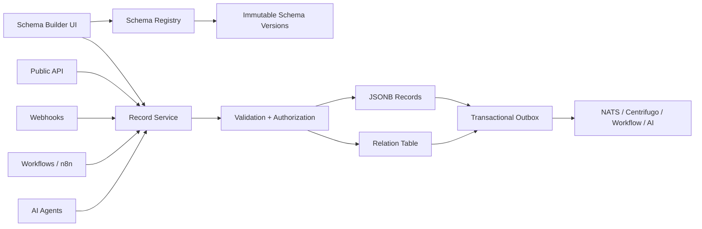

# التحليل المعماري وخطة تطوير منشئ المخططات

**المشروع:** Septimus OS  
**النطاق:** منشئ المخططات ومحرك قواعد البيانات بدون كود  
**التاريخ:** 2026-07-26  
**حالة الوثيقة:** مقترح تنفيذي مبني على مراجعة الواجهة والكود الخلفي وقاعدة البيانات والتكاملات الحالية

## حالة التنفيذ — الدفعتان الأولى والثانية

تم تنفيذ نواة المرحلتين 0 و1 بتاريخ 2026-07-26:

- فصل تعريفات المخططات عن جدول السجلات العام.
- إضافة `entity_definitions` و`entity_schema_versions` مع RLS.
- إضافة إصدار المخطط وإصدار السجل والمفتاح الثابت وقيمة العرض.
- منع `schema` من مسار `/entities` العام.
- توحيد إنشاء السجلات الديناميكية مع التحقق من المخطط المنشور.
- إضافة صلاحيات مستقلة وFeature Flag وحصص للباقة.
- إضافة APIs للمسودة والتحميل والتحقق والنشر والإصدارات.
- استبدال واجهة المنشئ الشكلية بمحرر مسودات حقيقي ثنائي اللغة.
- إضافة DnD فعلي ورسائل inline وتحميل المخططات المنشأة.
- تحويل نافذة إنشاء السجل القديمة من محاكاة إلى طلب API حقيقي.
- إضافة اختبارات لمنع نشر المخطط من المسار العام والتحقق من السجلات.
- إضافة API مستقل للسجلات تحت `/api/v1/data/:definitionKey/records` مع قفل
  تفاؤلي للسجل وCursor pagination.
- إضافة Query AST بقائمة حقول وعمليات مسموحة، وربط جميع القيم كمعاملات SQL.
- تنفيذ العلاقات في `entity_relations` و`entity_record_relations` مع عزل
  مساحة العمل وسياسات `restrict/nullify/cascade`.
- تنفيذ معادلات رقمية بخطوات parser وAST محلية؛ لا يستخدم المحرك `eval` أو
  JavaScript أو SQL أو استدعاءات دوال.
- إضافة `outbox_events` وربط حفظ السجل/العلاقات/الحدث في معاملة واحدة، مع
  إعادة المحاولة والنشر بنمط at-least-once.
- توحيد أحداث المحرك على:
  `events.data.schema.published` و`events.data.record.created|updated|deleted`.
- ربط الحدث نفسه بـWorkflow، وإجراءات n8n الموقعة الموجودة، وقناة
  Centrifugo `workspace_<uuid>`، وفهرسة AI.
- توحيد قنوات المحادثة والإشعارات على `channel_<uuid>` و`user_<uuid>` بدل
  الأسماء الخام أو بادئة `#`.
- إضافة نموذج سجل ديناميكي وجدول فعليين، بحث آمن، إنشاء وتعديل وحذف،
  وتحديث حي عبر Centrifugo.
- إضافة اختبار تكامل للخدمة يغطي المعادلة والعلاقة وOutbox، واختبار E2E
  ينشر مخططًا وينشئ سجلًا ويتحقق من القيمة المحسوبة والاستعلام.

### العقود التنفيذية الحالية

| الغرض | العقد |
|---|---|
| إنشاء سجل | `POST /api/v1/data/:definitionKey/records` |
| استعلام آمن | `POST /api/v1/data/:definitionKey/records/query` |
| قراءة سجل | `GET /api/v1/data/:definitionKey/records/:id` |
| تعديل متفائل | `PATCH /api/v1/data/:definitionKey/records/:id` |
| حذف وسياسات علاقات | `DELETE /api/v1/data/:definitionKey/records/:id` |
| API خارجي لـn8n | `/api/public/v1/data/:definitionKey/records...` مع API key scopes |
| AI داخلي للقراءة | `/internal/data/:definitionKey/records...` مع internal token ومساحة إلزامية |
| Realtime | `workspace_<workspaceUUID>` |

ما يزال خارج هذه الدفعة: مصمم ERD بصري، Views محفوظة، استيراد CSV، فهارس
مخصصة لكل حقل، وترحيلات backfill لتغييرات الأنواع الكاسرة. هذه ميزات توسعة
وليست مسارات زائفة في الواجهة الحالية.

## 1. الخلاصة التنفيذية

> الأقسام التالية تحفظ تحليل خط الأساس قبل التنفيذ لتوضيح سبب القرارات.
> حالة التنفيذ الفعلية المحدثة موثقة في القسم السابق.

واجهة خط الأساس قدمت تصورًا بصريًا جيدًا كبداية، لكنها لم تكن محرك قواعد
بيانات بدون كود مكتملًا. كانت العلاقات والمعادلات وإنشاء السجلات إشارات
بصرية قبل تنفيذ الدفعة الثانية.

توجد فجوة حرجة بين ما يحفظه منشئ المخططات وما يتوقعه التحقق الخلفي:

- الواجهة تحفظ الحقول في `data.fields`.
- مسار التحقق الخلفي يبحث عن JSON Schema داخل `data.schema`.
- مسار المتصفح الأساسي لإنشاء السجلات لا يستدعي أصلًا دالة التحقق الديناميكي الموجودة في الخلفية.
- مسارات الكيانات العامة لا تفرض صلاحيات خاصة بإدارة المخططات أو نشرها.
- اسم الكيان الظاهر للمستخدم يُستخدم كمعرف تقني، ولا يوجد مفتاح ثابت غير قابل للتغيير.

هذا يعني أن اعتبار زر «نشر الكيان» نشرًا فعليًا وآمنًا سيكون مضللًا في الوضع الحالي.

القرار المعماري المقترح هو بناء محرك هجين:

- الجداول النظامية الحساسة مثل الحسابات والموارد البشرية والهوية والجلسات تبقى جداول علائقية typed.
- منشئ المخططات يستخدم للوحدات المخصصة للعملاء فوق Metadata واضحة وسجلات JSONB.
- تعريفات المخططات وإصداراتها وعلاقاتها تحفظ في جداول مخصصة، لا كسجلات عادية من نوع `schema`.
- جميع عمليات السجلات، سواء جاءت من الواجهة أو API أو Webhook أو Workflow أو AI، تمر عبر خدمة مركزية واحدة للتحقق والصلاحيات والتدقيق وإطلاق الأحداث.

قاعدة البيانات الحالية تحتوي على 57 سجلًا ديناميكيًا ولا تحتوي على أي سجل من نوع `schema`. لذلك يمكن إعادة تصميم المنشئ الآن بتكلفة ترحيل منخفضة جدًا ودون الحاجة إلى دعم مخططات منشورة لعملاء حاليين.

## 2. تقييم الحالة الحالية

### 2.1 ما يعمل حاليًا

- إنشاء اسم كيان وقائمة حقول أولية.
- أنواع أولية في الواجهة: نص، رقم، تاريخ، قائمة، علاقة، معادلة، مستخدم، ملف.
- حفظ تعريف مبسط ككيان من نوع `schema`.
- تخزين السجلات العامة في جدول `entities` باستخدام JSONB.
- عزل مساحة العمل في النموذج وقواعد RLS الحالية.
- فهرس GIN عام على بيانات JSONB.
- أحداث عامة لإنشاء وتحديث الكيانات.
- توفر مكتبات مناسبة في الواجهة لتنفيذ السحب والإفلات ومخطط العلاقات:
  - `@hello-pangea/dnd`
  - `reactflow`
  - `@tanstack/react-query`

### 2.2 ما هو شكلي أو غير مكتمل

- زر «سجل جديد» يعرض تنبيهًا ولا يفتح نموذجًا مولدًا من المخطط.
- زر «عرض مخطط العلاقات» لا يعرض ERD حقيقيًا.
- زر «إعداد» لا يفتح إعدادات فعلية.
- رمز السحب موجود من دون منطق سحب وإفلات كامل.
- نوعا العلاقة والمعادلة مجرد اختيار واجهة ولا يقابلهما تنفيذ خلفي.
- نافذة إنشاء الكيان المشتركة الأخرى في المشروع محاكاة ولا ترسل طلبًا حقيقيًا.
- لا يوجد تحميل وتعديل لتعريف منشور، ولا مسودة، ولا تاريخ إصدارات، ولا تراجع.
- لا توجد طرق عرض محفوظة أو نماذج أو استيراد أو تصدير خاص بالمحرك.

### 2.3 الفجوات الحرجة

| الأولوية | الفجوة | الأثر |
|---|---|---|
| P0 | الواجهة تحفظ `fields` والخلفية تتوقع `schema` | لا يحدث تحقق حقيقي من البيانات حسب المخطط |
| P0 | مسار إنشاء السجلات من المتصفح يتجاوز دالة التحقق | يمكن حفظ بيانات غير مطابقة للمخطط |
| P0 | لا توجد صلاحيات `schemas.manage/publish` | أي عضو مصادق داخل مساحة العمل قد يدير المخططات |
| P0 | API العام يسمح بالتعامل مع `schema` كنوع كيان عادي | إمكانية إنشاء أو تعديل تعريفات خارج مسار النشر الموثوق |
| P0 | الاسم الظاهر هو المفتاح التقني | تغيير الاسم أو استخدام العربية والمسافات يكسر التكاملات |
| P1 | لا يوجد إصدار للمخطط أو فحص أثر التغيير | تعديل الحقول قد يكسر السجلات والـWorkflows بصمت |
| P1 | العلاقات تحفظ نظريًا داخل JSONB | لا توجد سلامة مرجعية أو سياسة حذف أو علاقة عكسية |
| P1 | البحث يستخدم `data::text ILIKE` | تدهور كبير في الأداء مع نمو البيانات |
| P1 | حفظ السجل وإطلاق الحدث غير ذريين | قد يحفظ السجل من دون وصول الحدث إلى Workflow أو AI |
| P1 | كل تحديث قد يولد embedding جديدًا | تضخم وفوضى في البحث الدلالي وتسريب حقول غير مناسبة |

## 3. القرار المعماري المقترح

لا يُنصح بإنشاء جدول PostgreSQL حقيقي أو تنفيذ `ALTER TABLE` لكل مخطط ينشئه المستخدم. هذا النموذج يرفع مخاطر القفل والترحيل والفهارس والصلاحيات والنسخ الاحتياطي، ويصعب تشغيله في بيئة متعددة المستأجرين.

المقترح:



### مبادئ التصميم

1. **تعريفات مستقلة عن السجلات:** المخطط Metadata نظامية، وليس سجلًا عاديًا.
2. **مفتاح ثابت:** لكل كيان `key` تقني ثابت، مع أسماء عرض عربية وإنجليزية قابلة للتغيير.
3. **إصدارات غير قابلة للتعديل:** كل نشر ينشئ إصدارًا جديدًا.
4. **خدمة مركزية للسجلات:** لا كتابة مباشرة إلى `entities` من أي قناة.
5. **JSON Schema موحد:** الخادم يولده ويستخدمه في التحقق، ولا يعتمد على بنية واجهة خاصة.
6. **العلاقات خارج JSONB:** سلامة العلاقات تتحقق بمفاتيح حقيقية وسياسات حذف واضحة.
7. **المعادلات بلا `eval`:** تستخدم لغة تعبيرات محدودة ومحلل AST آمن.
8. **التغيير الآمن:** حذف الحقل يبدأ بإهماله وإخفائه قبل أي تنظيف مادي.
9. **تعدد المستأجرين أولًا:** كل جدول جديد يحمل `workspace_id` وتطبق عليه RLS.
10. **الحدود التجارية:** الميزة والحقول والفهارس والسجلات تخضع لخطة الاشتراك.

## 4. نموذج البيانات المستهدف

### 4.1 جدول `entity_definitions`

يمثل الكيان المنطقي نفسه:

- `id`
- `workspace_id`
- `key`: ثابت، مثل `customer_visit`
- `label_ar`
- `label_en`
- `description`
- `icon`
- `color`
- `status`: `draft | published | archived`
- `current_version`
- `title_field_key`
- `is_system`
- `settings`
- `created_by`
- `updated_by`
- timestamps

قيد أساسي:

`UNIQUE (workspace_id, key)`

### 4.2 جدول `entity_schema_versions`

يحفظ كل إصدار منشور بصورة غير قابلة للتعديل:

- `definition_id`
- `workspace_id`
- `version`
- `json_schema`
- `ui_schema`
- `change_set`
- `checksum`
- `published_by`
- `published_at`

قيد أساسي:

`UNIQUE (definition_id, version)`

### 4.3 جدول `entity_fields`

فهرس Metadata للحقول يساعد في بناء العلاقات والاستعلامات والفهارس:

- `id`
- `workspace_id`
- `definition_id`
- `schema_version`
- `key`
- `label_ar`
- `label_en`
- `type`
- `position`
- `required`
- `is_unique`
- `is_indexed`
- `is_searchable`
- `classification`: `public | internal | confidential | pii`
- `config`

مفتاح الحقل ثابت ولا يتغير عند تغيير التسمية.

### 4.4 تطوير جدول `entities`

يبقى مخزن السجلات الديناميكية، مع إضافة:

- `definition_id`
- `schema_version`
- `display_value`
- `owner_id`
- `created_by`
- `updated_by`
- `record_version`
- `status`

يبقى `data JSONB` لحفظ الحقول الديناميكية.

### 4.5 جدول `entity_record_relations`

يحفظ العلاقات الفعلية:

- `workspace_id`
- `relation_definition_id`
- `source_record_id`
- `target_record_id`
- timestamps

يتيح ذلك:

- منع العلاقات بين مساحات عمل مختلفة.
- تطبيق `restrict/nullify/cascade` بصورة متحكم بها.
- الاستعلام العكسي.
- اكتشاف السجلات المرتبطة قبل الحذف.

### 4.6 جداول إضافية

- `entity_relations`: تعريف العلاقة والكاردينالية والسياسة.
- `entity_views`: الجدول، Kanban، التقويم، المعرض والفلاتر المحفوظة.
- `entity_forms`: تخطيط نموذج الإدخال والصلاحيات والتعليمات.
- `entity_import_jobs`: الاستيراد، المعاينة، الأخطاء والتراجع.
- `entity_index_requests`: إدارة الفهارس المسموحة ضمن الحصص.
- `outbox_events`: ضمان إطلاق الأحداث بعد نجاح المعاملة.

## 5. دورة حياة المخطط

الحالة المقترحة:

`Draft → Validate → Impact Review → Publish → Active → Archive`

### الحفظ كمسودة

- حفظ تلقائي مع debounce.
- قفل تفاؤلي عبر `version/etag`.
- سجل تغييرات وUndo/Redo.
- المسودة لا تؤثر على السجلات الحالية.

### التحقق

- صحة المفاتيح وتفردها.
- توافق الخيارات والقيم الافتراضية.
- صحة العلاقات.
- كشف دورات المعادلات.
- منع أنواع أو إعدادات غير متاحة في الخطة.
- توليد JSON Schema واختباره.

### فحص الأثر

قبل النشر يعرض:

- عدد السجلات غير المتوافقة.
- Workflows وواجهات API والنماذج المتأثرة.
- الفهارس التي ستنشأ أو تزال.
- الحقول التي تغير نوعها.
- العلاقات التي قد تصبح يتيمة.
- تكلفة backfill التقريبية.

### النشر

- إنشاء إصدار ثابت.
- تحديث `current_version` ذريًا.
- تسجيل Audit Log.
- نشر حدث `schema.published` عبر Outbox.
- تشغيل Backfill أو إنشاء فهرس كوظيفة خلفية عند الحاجة.

### التغييرات الحساسة

- تغيير التسمية: آمن، لا يغير المفتاح.
- جعل حقل اختياري مطلوبًا: يتطلب قيمة افتراضية أو معالجة السجلات القديمة.
- تغيير نوع حقل: يتطلب dry-run وترحيلًا قابلًا للاستئناف.
- حذف حقل: إهمال وإخفاء أولًا، ثم تنظيف لاحق بموافقة صريحة.
- حذف كيان: أرشفة افتراضيًا، والحذف النهائي عملية إدارية منفصلة.

## 6. أنواع الحقول المقترحة

### الإصدار الأول

- نص قصير وطويل
- رقم وصحيح وعشري
- عملة ونسبة
- Boolean
- تاريخ وتاريخ/وقت
- قائمة وقائمة متعددة
- بريد ورابط وهاتف
- حالة
- مستخدم أو فريق
- ملف خاص
- علاقة واحد/متعدد
- رقم تلقائي

### الإصدار الثاني

- معادلة
- Lookup
- Rollup
- Rich text
- موقع جغرافي
- توقيع
- حقول مركبة

### قواعد خاصة

- الملف يخزن معرفًا داخليًا أو معرف Drive/WorkDocs، وليس رابطًا عامًا.
- حقل المستخدم يقبل أعضاء مساحة العمل فقط.
- العملة تحفظ القيمة والوحدة وفق سياسة موحدة.
- التاريخ والوقت يخزنان UTC مع عرض المنطقة الزمنية.
- المعادلات لا تسمح بتنفيذ JavaScript أو SQL أو أوامر نظام.

## 7. تصميم API

### المخططات

- `GET /api/v1/schema-definitions`
- `POST /api/v1/schema-definitions`
- `GET /api/v1/schema-definitions/:id`
- `PATCH /api/v1/schema-definitions/:id/draft`
- `POST /api/v1/schema-definitions/:id/validate`
- `POST /api/v1/schema-definitions/:id/impact`
- `POST /api/v1/schema-definitions/:id/publish`
- `GET /api/v1/schema-definitions/:id/versions`
- `POST /api/v1/schema-definitions/:id/archive`

### السجلات

- `GET /api/v1/data/:definitionKey/records/:id`
- `POST /api/v1/data/:definitionKey/records`
- `PATCH /api/v1/data/:definitionKey/records/:id`
- `DELETE /api/v1/data/:definitionKey/records/:id`
- `POST /api/v1/data/:definitionKey/query`
- `POST /api/v1/data/:definitionKey/import/preview`
- `POST /api/v1/data/:definitionKey/import`
- `GET /api/v1/data/:definitionKey/export`

الاستعلام يجب أن يقبل AST محدودة ومتحققًا منها، مثل:

```json
{
  "filter": {
    "and": [
      {"field": "status", "op": "eq", "value": "active"},
      {"field": "amount", "op": "gte", "value": 1000}
    ]
  },
  "sort": [{"field": "created_at", "direction": "desc"}],
  "limit": 50,
  "cursor": "opaque-cursor"
}
```

لا يسمح بتمرير SQL أو JSONPath خام من العميل.

## 8. الصلاحيات والأمان

### صلاحيات مقترحة

- `schemas.view`
- `schemas.manage`
- `schemas.publish`
- `records.read`
- `records.create`
- `records.update`
- `records.delete`
- `records.export`
- `records.import`

يمكن لاحقًا تخصيصها لكل تعريف، ثم إضافة Field-level access للحقول الحساسة.

### ضوابط إلزامية

- منع النوع `schema` من مسارات الكيانات العامة ومفاتيح API العامة.
- التحقق من مساحة العمل في كل علاقة وكل سجل.
- RLS على كل جداول Metadata والعلاقات الجديدة.
- عدم الاعتماد على RLS وحدها؛ الصلاحية تطبق في خدمة المجال أيضًا.
- تسجيل من نشر المخطط ومن عدل السجل والقيم المتغيرة.
- حماية Mass Assignment عبر Allowlist مشتقة من إصدار المخطط.
- منع الحقول النظامية من الكتابة داخل `data`.
- فحص الملفات والامتداد والحجم والملكية قبل ربطها.
- إخفاء PII من السجلات والـLogs والـEmbeddings افتراضيًا.
- حدود لحجم JSON، عمق الشروط، عدد الحقول، تعقيد المعادلة ووقت التنفيذ.
- Idempotency Key لعمليات API وWebhook وWorkflow القابلة للتكرار.

## 9. تجربة الاستخدام المستهدفة

### تخطيط الشاشة

- **عمود المخططات:** بحث، مسودات، منشور، مؤرشف، قوالب.
- **منطقة العمل:** تبويبات الحقول، العلاقات، معاينة البيانات، النماذج، طرق العرض.
- **لوحة الخصائص:** إعدادات الحقل أو العلاقة المحددة.
- **شريط علوي:** حفظ المسودة، تحقق، فحص الأثر، نشر.

### إعداد الحقل

- الاسم العربي والإنجليزي.
- المفتاح التقني مع اقتراح تلقائي وقفل بعد النشر.
- الوصف والنص المساعد.
- النوع والقيمة الافتراضية.
- مطلوب، فريد، قابل للبحث، مفهرس.
- تصنيف الحساسية.
- قواعد الحد الأدنى والأقصى والنمط والخيارات.
- الظهور في الجدول والنموذج والبحث.

### إمكانات ضرورية

- سحب وإفلات حقيقي وإعادة ترتيب.
- Undo/Redo.
- حفظ تلقائي وحالة مزامنة.
- تحذير تعارض عند التعديل المتزامن.
- معاينة نموذج حقيقية.
- إنشاء سجل تجريبي داخل Sandbox.
- ERD تفاعلي باستخدام React Flow.
- دعم لوحة المفاتيح وقارئات الشاشة.
- تخطيط متجاوب بدل عرض ثابت للوحة الجانبية.
- رسائل خطأ inline بدل `alert`.

## 10. التكامل مع مكونات المشروع

### Workflows وn8n

أحداث موحدة:

- `data.schema.published`
- `data.record.created`
- `data.record.updated`
- `data.record.deleted`

كل حدث يتضمن:

- `workspace_id`
- `definition_key`
- `schema_version`
- `record_id`
- `changed_fields`
- `actor`
- `event_id`

العقد المطلوبة:

- Trigger عند إنشاء أو تحديث أو حذف سجل.
- شرط على الحقول باستخدام AST نفسها.
- إنشاء سجل وتحديثه وربطه.
- Query records.
- انتظار موافقة قبل تعديل حقول حساسة.

### AI

الاستخدامات الآمنة والمفيدة:

- تحويل وصف المستخدم إلى **مسودة** مخطط.
- اقتراح أنواع الحقول وقواعد التحقق.
- شرح أثر التغيير.
- إنشاء معادلة ضمن اللغة المقيدة.
- تحويل سؤال طبيعي إلى Query AST.
- اقتراح طرق عرض ولوحات.

لا يسمح للـAI:

- بتنفيذ DDL.
- بنشر مخطط مباشرة.
- بتجاوز صلاحيات المستخدم.
- بقراءة حقول حساسة خارج سياسة الوصول.

### البحث والـEmbeddings

- تضمين الحقول المحددة `searchable` فقط.
- استثناء الملفات والحقول السرية وPII افتراضيًا.
- Upsert لمتجه واحد لكل سجل وإصدار بدل إنشاء نسخ متكررة.
- حذف أو تحديث المتجه عند حذف السجل أو تغيير الحقول المستخدمة.

### Drive وWorkDocs

- حفظ معرف الملف وموفره ونسخته فقط.
- التحقق من عضوية مساحة العمل قبل العرض.
- روابط تنزيل قصيرة العمر وموقعة.
- عدم تحويل المرفقات إلى ملفات عامة.
- Workflow لنقل الملف أو نسخه لا يغير صلاحياته ضمنيًا.

### Centrifugo

قنوات مقترحة موحدة:

- `workspace:{workspaceId}:schema:{definitionId}`
- `workspace:{workspaceId}:data:{definitionKey}`
- `workspace:{workspaceId}:record:{recordId}`

تستخدم لتحديث حالة المسودة، النشر، البيانات ونتائج الوظائف الخلفية، مع توليد الاشتراك من الخادم وفق الصلاحية.

## 11. الأداء والفهرسة

- الإبقاء على GIN العام كخط دفاع أول.
- إنشاء Expression Indexes فقط للحقول المنشورة كثيرة الاستخدام.
- تحديد حد أعلى لعدد الفهارس لكل مساحة وخطة.
- عدم السماح للمستخدم بكتابة تعبير فهرس أو SQL.
- استخدام cursor pagination بدل offset في القوائم الكبيرة.
- إنشاء `display_value` وحقول projection للعرض والبحث السريع.
- استبدال `data::text ILIKE` ببحث موجّه على حقول محددة أو `search_vector`.
- استخدام Materialized Views أو جداول typed للعمليات التحليلية والمالية الثقيلة.
- تنفيذ إنشاء الفهارس وعمليات backfill في Jobs قابلة للاستئناف والمراقبة.

## 12. الاختبارات ومعايير القبول

### اختبارات خلفية

- إنشاء وتعريف ونشر مخطط.
- التحقق من كل نوع حقل.
- رفض الحقول غير المعروفة.
- توافق السجل مع إصدار المخطط.
- تغيير النوع وفحص الأثر.
- سلامة العلاقات وسياسات الحذف.
- الفصل بين مساحات العمل.
- صلاحيات العرض والإدارة والنشر.
- Idempotency والتحديث التفاؤلي.
- Query AST ومنع الحقن.
- Outbox وتسليم الأحداث.

### اختبارات واجهة وE2E

- بناء مخطط بالسحب والإفلات.
- حفظ واستعادة المسودة.
- نشر مخطط وإنشاء سجل حقيقي.
- التحقق من الرسائل inline.
- إنشاء علاقة وعرضها في ERD.
- تعديل متزامن وتعارض الإصدار.
- تدفق Workflow كامل من record.created إلى إجراء لاحق.
- ربط ملف خاص والتحقق من عدم إتاحته للعامة.
- لوحة المفاتيح وRTL والاستجابة للشاشات.

### اختبارات تشغيلية

- 100 ألف سجل في تعريف واحد.
- استعلامات فلترة وفرز متزامنة.
- مخطط كبير ضمن الحد التجاري.
- Backfill قابل للاستئناف.
- فشل NATS أو Centrifugo دون فقد الحدث.
- فشل توليد Embedding دون تعطيل معاملة السجل.

يعد الإصدار جاهزًا فقط عندما تكون جميع مسارات الكتابة، بما فيها API وWebhook وWorkflow وAI، خاضعة لنفس التحقق والصلاحيات والتدقيق.

## 13. خطة التنفيذ

### المرحلة 0 — إغلاق المخاطر الحالية، 3–5 أيام

- إخفاء المنشئ خلف Feature Flag وصلاحية.
- منع `schema` في API الكيانات العام.
- توحيد إنشاء وتحديث السجل عبر خدمة تحقق واحدة.
- إنشاء مفتاح تقني ثابت.
- إلغاء الرسائل التي تدعي نشرًا كاملًا قبل اكتمال النشر.
- إضافة اختبارات الفصل بين المستأجرين والصلاحيات والتحقق.

### المرحلة 1 — Metadata والإصدارات، 7–10 أيام

- إنشاء جداول التعريفات والإصدارات والحقول.
- APIs للمسودة والتحقق والأثر والنشر.
- JSON Schema 2020-12 موحد.
- Audit وOptimistic Locking.
- ترحيل واجهة المنشئ إلى المسارات الجديدة.

### المرحلة 2 — محرك السجلات، 10–15 يومًا

- Record Service مركزي.
- مولد نموذج وجدول حقيقيان.
- CRUD، فلاتر، فرز وcursor pagination.
- طرق عرض محفوظة أساسية.
- استيراد بمعاينة وتقرير أخطاء.

### المرحلة 3 — العلاقات والمعادلات، 10–15 يومًا

- تعريف العلاقات وسجلات الربط.
- ERD تفاعلي.
- Lookup وFormula محدودة.
- كشف الدورات وسياسات الحذف.
- Backfill وترحيل آمن للأنواع.

### المرحلة 4 — التكاملات، 7–10 أيام

- Outbox وأحداث البيانات.
- عقد Workflow وn8n.
- قنوات Centrifugo الموحدة.
- Drive/WorkDocs private references.
- AI draft/query assistant ضمن الصلاحيات.

### المرحلة 5 — التقوية والإطلاق، 7–10 أيام

- E2E فعلي.
- اختبارات تحميل وأمن.
- ضبط الفهارس والبحث.
- Monitoring وAlerting ولوحات الوظائف.
- توثيق المطور والمستخدم وRunbook الاسترجاع.

التقدير الإجمالي لفريق من مطوري Backend واثنين Frontend وQA هو 8–10 أسابيع تقريبًا. لمطور واحد، التقدير الواقعي 12–16 أسبوعًا. التقدير يتغير بحسب مستوى دعم المعادلات والاستيراد وطرق العرض في الإصدار الأول.

## 14. حدود MVP الموصى بها

حتى لا يتحول الإصدار الأول إلى منصة ضخمة غير قابلة للضبط، يجب أن يشمل:

- نص، رقم، Boolean، تاريخ، قائمة، مستخدم، ملف، علاقة.
- مسودة، تحقق، فحص أثر، نشر وإصدارات.
- نموذج وجدول.
- CRUD وفلاتر وفرز.
- Audit وصلاحيات وRLS.
- Workflow trigger/action أساسي.
- E2E وفحص تحميل.

ويؤجل إلى الإصدار التالي:

- Formula وRollup المعقدة.
- بناء مخطط كامل بالذكاء الاصطناعي مع نشر ذاتي.
- التقارير التحليلية الثقيلة.
- Marketplace للقوالب.
- حقول مركبة وتخصيصات واجهة عميقة.

## 15. مؤشرات النجاح

- 100% من عمليات الكتابة تمر عبر `RecordService`.
- 0 مسار عام يسمح بإنشاء أو تعديل تعريف مخطط.
- 100% من الإصدارات المنشورة ثابتة ومدققة.
- p95 للاستعلامات الشائعة أقل من 300ms ضمن الحجم المستهدف.
- عدم فقد الأحداث عند تعطل NATS مؤقتًا.
- عدم ظهور ملف خاص عبر رابط دائم عام.
- تغطية جميع أنواع الحقول والعلاقات باختبارات تكامل.
- نجاح E2E من إنشاء المخطط حتى تشغيل Workflow على سجل.
- عدم وجود تسريب بين مساحات العمل في اختبارات RLS والتطبيق.

## 16. ترتيب القرار والتنفيذ

1. اعتماد المعمارية الهجينة وعدم استخدام جداول فعلية لكل عميل.
2. تنفيذ المرحلة 0 قبل إتاحة المنشئ لأي مستخدم إنتاجي.
3. بناء Registry والإصدارات قبل إضافة أنواع حقول جديدة.
4. توحيد مسارات الكتابة قبل ربط AI أو n8n.
5. إطلاق MVP محدود، ثم العلاقات والمعادلات المتقدمة.
6. إعادة بناء حاويات Docker والتحقق الصحي والوظيفي فقط بعد اكتمال الإصلاحات والاختبارات.

## 17. الملفات الحالية الأكثر ارتباطًا بالتنفيذ

- `frontend/src/components/entities/EntityCreator.tsx`
- `frontend/src/components/shared/EntityCreatorModal.tsx`
- `frontend/src/components/layout/Sidebar.tsx`
- `frontend/src/app/page.tsx`
- `backend-core/handlers/entities.go`
- `backend-core/handlers/agent_api.go`
- `backend-core/handlers/webhook.go`
- `backend-core/handlers/search_omni.go`
- `backend-core/models/models.go`
- `backend-core/services/orchestrator.go`
- `backend-core/services/entitlements.go`
- `backend-core/main.go`
- `database/seed.go`
- `docs/02_DATABASE_AND_ENTITIES.md`
- `docs/COMPREHENSIVE_AUDIT_2026-07-26.md`

الأقسام التحليلية في هذه الوثيقة تحفظ خط الأساس قبل التنفيذ. الحالة المنفذة
موثقة في بداية الوثيقة، أما خطة الاستكمال المعتمدة فتوجد في
`SCHEMA_BUILDER_EXECUTION_PLAN_2026-07-28.md`.
