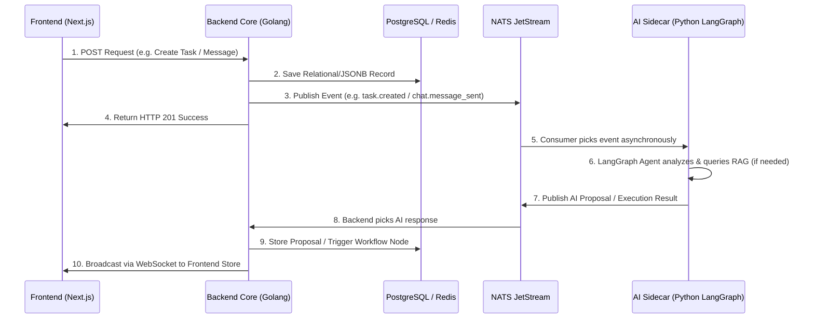

# Septimus OS - Deep Architecture & Logic Analysis

نظام **Septimus OS** هو نظام تشغيل مؤسسي شامل ومعزز بالذكاء الاصطناعي (`AI-First Enterprise OS`)، يعتمد على معمارية الخدمات المصغرة الهجينة (`Event-Driven Monolith + Asynchronous AI Sidecar + Real-time WebSockets`).

---

## 1. محرك الواجهة الخلفية (`/backend-core` - Golang Fiber)

تم بناء النواة بلغة **Golang** باستخدام إطار **Fiber** العالي الأداء، وتعمل كمصدر الحقيقة المعتمد (`Single Source of Truth`).

### أبرز المكونات الهيكلية

- **`main.go`**: نقطة تهيئة إطار Fiber، الاتصال بـ PostgreSQL عبر GORM، إعداد حافلة NATS JetStream، وتسجيل جميع المسارات والوساطات.
- **`database/database.go`**: إدارة اتصال قاعدة البيانات وتشغيل `AutoMigrate` لـ 29 كياناً، مع تفعيل امتدادات `ltree` و `vector` و `tsvector`، وزرع أدوار وصلاحيات الـ RBAC الابتدائية.
- **`middleware/*`**: حزمة الحماية الشاملة (`jwt.go` للتحقق من الهوية، `rbac.go` للتحقق من الصلاحيات الدقيقة، `internal.go` لحماية اتصال الـ Sidecar عبر `X-Internal-Token`، و `apikey.go`).

### معالجات النطاقات الميدانية (`/handlers`)

1. **نطاق التوثيق والحسابات (`Auth & RBAC`)**: التسجيل، تسجيل الدخول، تسجيل دخول Google OAuth، إدارة الحسابات، وصلاحيات ومجموعات الأقسام (`org_chart.go`, `admin.go`).
2. **نطاق إدارة المشاريع الأجايل (`Agile PM`)**: إدارة المشاريع، السكروم (`Sprint`)، المهام الشجرية باستخدام `ltree`، وسجل التعديلات (`pm.go`, `pm_update.go`, `sprint.go`, `workdocs.go`).
3. **نطاق التعاون والمحادثات اللحظية (`Chat & Real-time`)**: الغرف، سلاسل الردود (`Threads`)، البحث الكامل الفوري (`tsvector`)، إدارة جلسات الويب سوكت (`websocket.go`) والغرف الصوتية (`huddle.go`).
4. **نطاق الحضور والموارد البشرية (`HR Attendance & Geofencing`)**: إدارة الفروع والإحداثيات، تسجيل الحضور وحساب المسافات الجغرافي (`haversine distance`) مع محاكي فحص النطاق (`attendance.go`).
5. **نطاق الأتمتة وسير العمل (`Workflows & Integrations`)**: محرك تنفيذ المخططات (`DAG Executor`) الداعم للعقد المخصصة (`ai_agent`, `send_slack`, `send_email`) مع مشغلات ناتجة عن أحداث النظام (`workflow_executor.go`).
6. **نطاق الكيانات الديناميكية (`Entities - JSONB Engine`)**: معالجة الكيانات المرنة (`entities.go`) مثل الفواتير، صفقات الـ CRM، وطلبات الإجازات بمرونة دون الحاجة لـ Migrations.

---

## 2. خدمة الذكاء الاصطناعي (`/ai-sidecar` - Python FastAPI & LangGraph)

تعمل خدمة **`ai-sidecar`** بلغة **Python** وتعتمد على **FastAPI** و **LangGraph** كعقل تحليلي وإبداعي مستقل يتصل بالواجهة الخلفية عبر الـ HTTP و NATS.

### هيكلة الطبقة التحليلية

- **`main.py` & `providers.py`**: استقبال الطلبات المؤمنة بـ `X-Internal-Token` وتمريرها لنماذج الذكاء الاصطناعي (Gemini 3.1 Pro, OpenAI, Anthropic).
- **`agents_chat.py`**: محرك LangGraph المسؤول عن تخطيط الوكلاء المتعددين والرد على الاستفسارات المعقدة.
- **`nats_events.py`**: مستمع أحداث NATS JetStream (`chat.message_sent`, `task.created`) وتحليلها لنشر اقتراحات استباقية أو تشغيل مهام أتمتة.
- **`knowledge.py`**: محرك الـ RAG المتصل بمتجهات `pgvector` للبحث الدلالي.
- **`voice_realtime.py`**: إدارة الجلسات الصوتية التفاعلية الحية.

---

## 3. الواجهة الأمامية (`/frontend` - Next.js 15 & Tailwind v4)

مبنية بإطار **Next.js 15 (App Router)**، مع أنظمة تصميم `Tailwind CSS v4` و `shadcn/ui` و `Zustand`.

### أبرز اللوحات والمكونات

- **التعاون والمشاريع:** لوحة كانبان التفاعلية (`KanbanBoard.tsx`) وشريط المحادثات المتشعب (`ThreadSidebar.tsx`).
- **الموارد البشرية المتقدمة:** واجهة الحضور والضبط الجغرافي الديناميكي (`AttendanceView.tsx`) مع زر اعتماد الموقع ومحاكي الـ GPS.
- **إدارة علاقات العملاء والمالية:** لوحة الـ CRM التفاعلية (`ChatPanel.tsx` و `AIMetricsCard.tsx`) مع تقييمات 👍/👎 لردود الذكاء الاصطناعي، ولوحة الإدارة المالية (`FinanceView.tsx`).
- **منصات الأتمتة والإضافات:** منشئ سير العمل التفاعلي (`WorkflowCanvas.tsx` و `CustomNodes.tsx`) ومتجر الإضافات (`PluginsStore.tsx`).

---

## 4. تدفق البيانات التفاعلي الموزع (`End-to-End Data Flow`)

